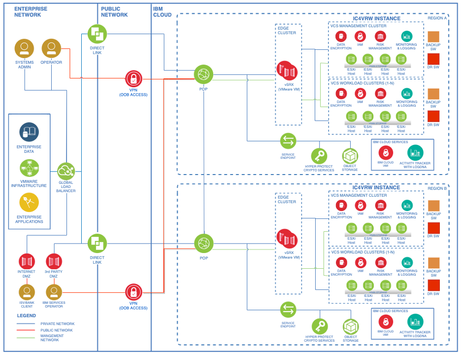

# VMware Regulated Workloads on IBM Cloud

The **VMware® Regulated Workloads** offering includes a secure-by-default architecture that follows the IBM® unique policy controls framework. It also includes continuous compliance monitoring and the highest level of data encryption FIPS 140-2 Level 4.

!!! important

    Review the following specifications before you begin.

    - VMware Regulated Workloads is only available for single-zone topology.
    - VMware Regulated Workloads are based on VMware NSX-T™ and VMware vSphere® 7.
    - [Hyper Protect Crypto Services](https://cloud.ibm.com/catalog/services/hyper-protect-crypto-services), [KMIP for VMware](https://cloud.ibm.com/infrastructure/vmware-solutions/console/servicestandalonenew/KMIPAdapter), and [Direct Link Dedicated](https://cloud.ibm.com/interconnectivity/direct-link) are required for VMware Regulated Workloads. Ensure that you order these services before you start your VMware Regulated Workloads order.
    - Some of the services require configuration setup. Review each service and ensure that you configure its settings properly, as indicated.
    - The **Private network only** option is available for all clusters. The **Public and private network** option is available only for the gateway cluster.

For more information about the requirements and deployment, see [VMware Regulated Workloads overview](https://cloud.ibm.com/docs/vmwaresolutions?topic=vmwaresolutions-vrw-overview).

## Services of VMware Regulated Workloads

The following services are required for VMware Regulated Workloads:

- [Hyper Protect Crypto Services](https://cloud.ibm.com/catalog/services/hyper-protect-crypto-services)
- [KMIP for VMware](https://cloud.ibm.com/infrastructure/vmware-solutions/console/servicestandalonenew/KMIPAdapter)
- [Direct Link Dedicated](https://cloud.ibm.com/interconnectivity/direct-link)

The following services are included with VMware Regulated Workloads:

- [Veeam Backup and Replication](https://cloud.ibm.com/docs/vmwaresolutions?topic=vmwaresolutions-veeamvm_overview)
- [Caveonix RiskForesight](https://cloud.ibm.com/docs/vmwaresolutions?topic=vmwaresolutions-caveonix_considerations)
- [Juniper vSRX](https://cloud.ibm.com/docs/vmwaresolutions?topic=vmwaresolutions-juniper-overview). This service is included when you choose **Gateway cluster with Juniper vSRX**.
- [VMware Aria Operations and VMware Aria Operations for Logs](https://cloud.ibm.com/docs/vmwaresolutions?topic=vmwaresolutions-vrops_overview)

The following services are optional for VMware Regulated Workloads:

- [VMware HCX](https://cloud.ibm.com/docs/vmwaresolutions?topic=vmwaresolutions-hcx_considerations)
- [F5 BIG-IP](https://cloud.ibm.com/docs/vmwaresolutions?topic=vmwaresolutions-f5_considerations)

For more information, see [Planning for VMware Regulated Workloads](https://cloud.ibm.com/docs/vmwaresolutions?topic=vmwaresolutions-vrw-planning).

## Reference architecture

The Regulated Workloads VMware reference solution is intended for Bank, Financial Institutions, or SaaS provider applications running in a VMware environment managed by IBM. It addresses security controls and requirements outlined in the IBM Cloud Policy Framework for Financial Services, which is currently based on US regulations. It does not address European or other regulation requirements outside the US.

It is based on [IBM Cloud for VMware Regulated Workloads (IC4VRW)](https://cloud.ibm.com/docs/vmwaresolutions?topic=vmwaresolutions-vrw-overview&_gl=1*x2jb35*_ga*MjcxNzQwMjkzLjE2OTUzOTg4MjM.*_ga_FYECCCS21D*MTY5NTM5ODgyMi4xLjEuMTY5NTQwMjYzOS4wLjAuMA.) and includes the requirements, solution components, high level architecture diagram and architecture decisions.

### Regulated workloads solutions diagram

This Reference Solution illustrates a private network environment for deploying these applications. All access to the applications is through the enterprise network (bank, financial institution, or SaaS provider). Access patterns to these applications are determined by the Bank or financial institution and/or SaaS provider requirements.

Details for the access to the Bank, financial institution, or SaaS provider apps deployed in the VMware workload cluster are out of the scope of this reference solution. As an example, SaaS provider applications are typically consumed by banks or financial institution workloads which might be running on premises or on The IBM Cloud for VMware Regulated Workloads.

This Reference Solution illustrates a private network environment for deploying these applications. All access to the applications is through the enterprise network (bank, financial institution, or SaaS provider). Access patterns to these applications are determined by the Bank or financial institution and/or SaaS provider requirements.

Details for the access to the Bank, financial institution, or SaaS provider apps deployed in the VMware workload cluster are out of the scope of this reference solution. As an example, SaaS provider applications are typically consumed by banks or financial institution workloads which might be running on premises or on The IBM Cloud for VMware Regulated Workloads.

The _Reference Architecture Diagram_ shows the solution for Option 1 (Recommended) using Juniper vSRX in the VCS Edge Cluster.

For more information including the component list and for other options, see [VMware regulated workloads solution diagram](https://www.ibm.com/cloud/architecture/decision-guides/vmware-regulated-workloads/components-vmware).

### Architecture decisions

For a comprehensive list of requirements, alternatives, and decisions, see:

- [Compute and storage decisions](https://www.ibm.com/cloud/architecture/decision-guides/vmware-regulated-workloads/storage-vmware)
- [Networking decisions](https://www.ibm.com/cloud/architecture/decision-guides/vmware-regulated-workloads/networking-vmware)
- [Security decisions](https://www.ibm.com/cloud/architecture/decision-guides/vmware-regulated-workloads/security-vmware)
- [Resiliency and service management decisions](https://www.ibm.com/cloud/architecture/decision-guides/vmware-regulated-workloads/service-mgmt-vmware)

## How to order VMware Regulated Workloads

Review documentation at [Requirements for VMware Regulated Workloads](https://cloud.ibm.com/docs/vmwaresolutions?topic=vmwaresolutions-vrw-orderinginstance-req).

Then see, [Procedure to order VMware Regulated Workloads](https://cloud.ibm.com/docs/vmwaresolutions?topic=vmwaresolutions-vrw-orderinginstance-procedure)

## References

- [VMware Regulated Workloads overview](https://cloud.ibm.com/docs/vmwaresolutions?topic=vmwaresolutions-vrw-overview)
- [VMware regulated workloads decision guide](https://www.ibm.com/cloud/architecture/decision-guides/vmware-regulated-workloads/overview-vmware)
- [IBM Cloud for VMware Regulated Workloads (IC4VRW)](https://cloud.ibm.com/docs/vmwaresolutions?topic=vmwaresolutions-vrw-overview&_gl=1*x2jb35*_ga*MjcxNzQwMjkzLjE2OTUzOTg4MjM.*_ga_FYECCCS21D*MTY5NTM5ODgyMi4xLjEuMTY5NTQwMjYzOS4wLjAuMA.)
