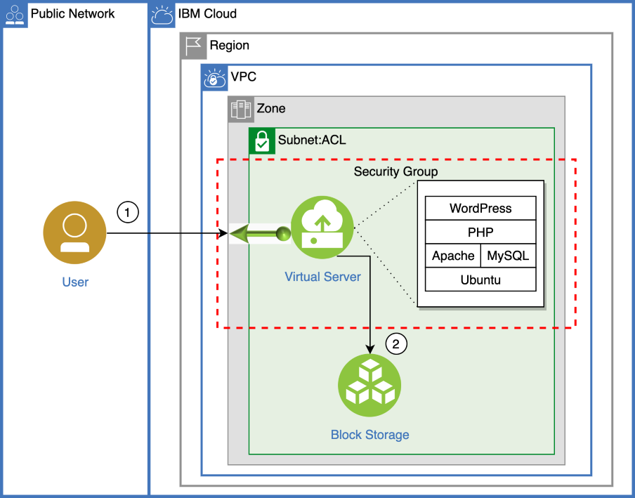
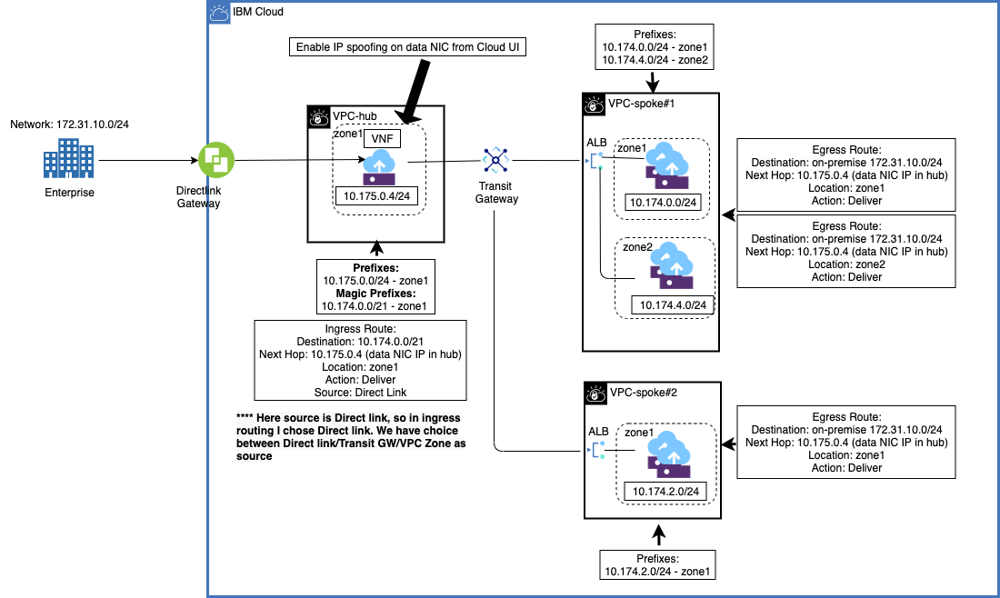
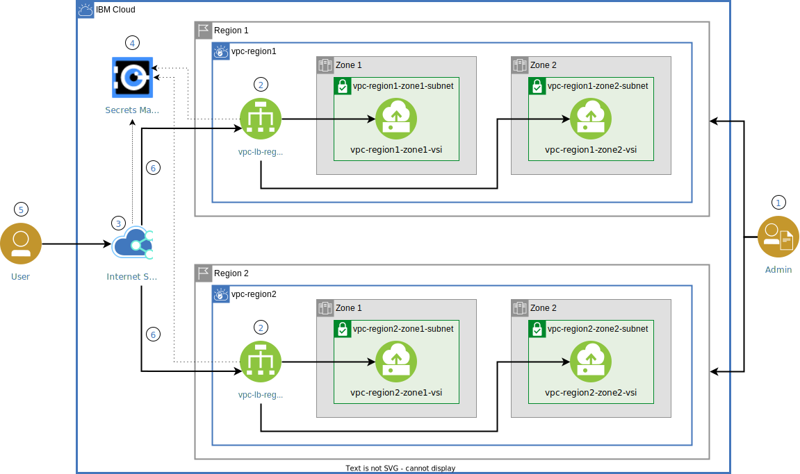

# Virtual Private Cloud (VPC) Architecture on the public cloud

**IBM Cloud® Virtual Private Cloud (VPC)** is a virtual network that provides a way to manage your compute, storage, and networking resources. 

!!! Key

    With IBM Cloud VPC, you define and control a virtual network in logically isolated parts of the IBM Cloud where you can run and support your mission-critical, cloud-tolerant, and cloud-native applications. 

IBM Cloud VPC gives you the security of a private cloud with the availability, cost-effectiveness, and scalability of the public cloud. 

## Overview

Each VPC is deployed to a single region. Within that region, the VPC can span multiple zones as shown in this sample architecture.

Subnets in your VPC can connect to the public internet through an optional public gateway. You can assign floating IP addresses to any virtual server instance to enable it to be reachable from the internet, independent of whether its subnet is attached to a public gateway.

Subnets within the VPC offer private connectivity; they can talk to each other over a private link through the implicit router. Setting up routes is not necessary. The following illustration shows how you can subdivide a virtual private cloud with subnets and each subnet can reach the public internet.

## LAMP stack application

The following diagram shows how to deploy a Ubuntu Linux virtual server with Apache web server, MySQL database and PHP scripting (LAMP) on IBM Cloud Virtual Private Cloud (VPC) Infrastructure.

This example shows how to deploy a WordPress application.

1. End user accesses the LAMP server running on a VPC using a web browser.
2. The VSI is configured to use data from an encrypted Block Storage volume (optional).

See [PHP web application on a LAMP Stack in VPC](https://cloud.ibm.com/docs/solution-tutorials?topic=solution-tutorials-lamp-stack-on-vpc).

## External connectivity

External connectivity can be achieved by using a public gateway that is attached to a subnet, or a floating IP address that is attached to a virtual server instance. Use a public gateway for _source network address translation (SNAT)_ and a floating IP for _destination network address translation (DNAT)_.

!!! Tip

    - [Use a public gateway for external connectivity of a subnet](https://cloud.ibm.com/docs/vpc?topic=vpc-about-networking-for-vpc&interface=ui#public-gateway-for-external-connectivity)
    - [Use a Floating IP address for external connectivity of a virtual server instance](https://cloud.ibm.com/docs/vpc?topic=vpc-about-networking-for-vpc&interface=ui#floating-ip-for-external-connectivity)

See [VPC External connectivity](https://cloud.ibm.com/docs/vpc?topic=vpc-about-networking-for-vpc&interface=ui#external-connectivity).

## Security

Security groups and access control lists (ACLs) provide ways to control the traffic across the subnets and instances in your IBM Cloud® Virtual Private Cloud, using rules that you specify. Security groups and ACLs add security to your subnets and instances:

Traffic to and from a subnet can be controlled by Access Control Lists (ACLs).
Security Groups can control the traffic at the virtual server instance level.
Allow you to set up a public gateway for subnet access to the internet, guarded by ACLs.
Allow you to implement a floating IP for virtual server instance access to the internet, guarded by SGs.

See [VPC Security Overview](https://cloud.ibm.com/docs/vpc?topic=vpc-security-in-your-vpc&interface=ui#security-overview).

## VPC Hub and Spoke

The following diagram illustrates how you can put together multiple VPCs into a Hub and Spoke pattern.

For more information, see

- [Extend to Advanced Elements](https://cloud.ibm.com/docs/vpc-journey?topic=vpc-journey-vpc-advanced-elements)
- [Centralize communication through a VPC Transit Hub and Spoke architecture - Part one](https://cloud.ibm.com/docs/solution-tutorials?topic=solution-tutorials-vpc-transit1)
- [Centralize communication through a VPC Transit Hub and Spoke architecture - Part two](https://cloud.ibm.com/docs/solution-tutorials?topic=solution-tutorials-vpc-transit2)

## VPC with Red Hat OpenShift

If you want to use containers, you can add [Red Hat OpenShift on IBM Cloud](https://cloud.ibm.com/docs/openshift?topic=openshift-roks-overview) to your VPC. Except for the addition of Red Hat OpenShift on IBM Cloud, you use the same architectural patterns and components that were described for the [Single-region IBM Cloud for Financial Services reference architecture for VPC with Virtual Servers for VPC](https://cloud.ibm.com/docs/framework-financial-services?topic=framework-financial-services-vpc-architecture-detailed-vsi).

The following diagram shows an example of a single region IBM Cloud for Financial Services reference architecture for VPC with Red Hat OpenShift on IBM Cloud.

In this architecture, a transient gateway links the control plane VPC to the worker nodes VPC.

!!! note "OpenShift deployment options"

    You can choose to use Red Hat OpenShift on IBM Cloud alongside (or instead of) virtual servers in either or both VPCs. Even though it is shown in the diagram as an option, it is not required to put Red Hat OpenShift on IBM Cloud in your management VPC.

For more information, see [Single-region IBM Cloud for Financial Services reference architecture for VPC with Red Hat OpenShift on IBM Cloud](https://cloud.ibm.com/docs/framework-financial-services?topic=framework-financial-services-vpc-architecture-detailed-openshift).

## Autoscaling

The following diagram illustrates how you can scale workloads in shared and dedicated VPC environments.

1. The frontend app deployed on VSI(s) communicates to the backend app via the private load balancer.
2. The backend app securely communicates with the cloud services via a virtual private endpoint (VPE).
3. As the load on the application increases, scaling for VPC is enabled and dynamically adds or removes VSIs based on metrics like CPU, RAM, etc., or through scheduled scaling.
4. As the scope expands, dedicated host isolates and performs heavy computation on the data. Resize the instance on the dedicated host by updating the profile based on your requirement. Also, expand the block storage volume capacity.
5. All instances communicate with IBM Cloud services over the private backbone using a virtual private endpoint (VPE). See the About virtual private endpoint gateways topic for more details.

See [Scale workloads in shared and dedicated VPC environments](https://cloud.ibm.com/docs/solution-tutorials?topic=solution-tutorials-vpc-scaling-dedicated-compute).

## Deploy into multiple regions

The following diagram shows how you can set up highly available and isolated workloads by provisioning IBM Cloud® Virtual Private Clouds (VPCs). 

1. The admin (DevOps) provisions VSIs in subnets under two different zones in a VPC in region 1 and repeats the same in a VPC created in region 2.
2. The admin creates a load balancer with a backend pool of servers in different zones of region 1 and a frontend listener. Repeats the same in region 2.
3. The admin provisions a IBM Cloud Internet Services instance with an associated custom domain and creates a global load balancer pointing to the load balancers created in two different VPCs.
4. The admin enables HTTPS encryption by adding the domain SSL certificate to the Secrets Manager service.
5. The user makes an HTTP/HTTPS request and the global load balancer handles the request.
6. The request is routed to the load balancers both on the global and local level. The request is then fulfilled by the available server instance.

See [Deploy isolated workloads across multiple locations and zones](https://cloud.ibm.com/docs/solution-tutorials?topic=solution-tutorials-vpc-multi-region).

## IBM Cloud Hyper Protect Virtual Servers for VPC

Confidential computing is enabled on **LinuxONE** (s390x processor architecture) by using the **IBM Secure Execution for Linux** technology. This technology is part of the hardware of IBM z15 (z15) and IBM LinuxONE III generation systems. With IBM Secure Execution for Linux, you can securely deploy workloads in the cloud. It ensures the integrity and confidentiality of boot images, and server authenticity. Applications are isolated from the operating system, thus providing more privacy and security for the workload.

See [Confidential computing with LinuxONE](https://cloud.ibm.com/docs/vpc?topic=vpc-about-se&interface=ui).

## Next steps

See [Deploy VPC](./vpc-deployment.md).

## References

- [Virtual private cloud reference architecture](https://www.ibm.com/cloud/architecture/architectures/virtual-private-cloud/reference-architecture)
- [Single-region IBM Cloud for Financial Services reference architecture for VPC with Red Hat OpenShift on IBM Cloud](https://cloud.ibm.com/docs/framework-financial-services?topic=framework-financial-services-vpc-architecture-detailed-openshift).
