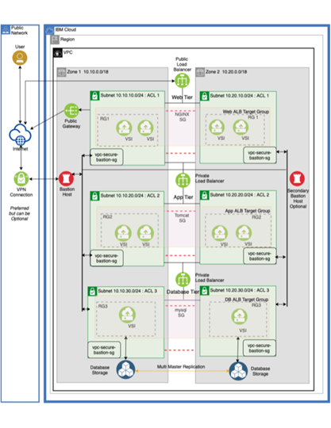
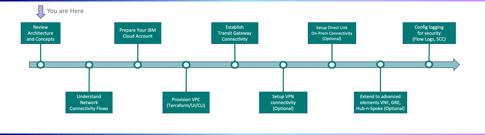

# IBM Cloud VPC Solutions

**IBM Cloud® Virtual Private Cloud (VPC)** is a highly resilient and highly secure software-defined network (SDN) for you to build isolated private clouds for your business operations while maintaining essential public cloud benefits. 

!!! key "Key business value"

    - Reduce CapEx on traditional IT network devices (routers, switches, load balancers, firewalls, etc.)
    - IBM Cloud leads as a secure, trusted, and industry ready cloud
    - VPC is a _purpose built_ cloud services platform for Power VS, VMware, SAP, IBM Z, and x86 leveraging IBM business process approach, domain knowledge and expertise
    - Focused on our client’s journey to hybrid IaaS, PaaS, and platform solutions

Support hybrid or multicloud platforms. Streamline workloads across the entire IBM Cloud stack with solutions for VMware, SAP, IBM Z and more.

IBM Cloud VPC is a privately owned software defined network (SDN) with built-in security, regulatory compliance standards, and multiple hardware and software solutions for confidential computing.

Built to spec for quick access, low-cost migration, low latency, and certified security.

!!! info "Private network in the public cloud"

    A Virtual Private Cloud (VPC) is a private network in the public cloud.

    - Get the logical isolation and security of a private cloud
    - Get the availability, cost effectiveness, and scalability of the public cloud

## Top use cases

!!! key "Use cases"

    - **Host and scale web applications**. Build your web presence in the cloud, leveraging best-in-class network performance and reliability.
    - **Extending capacity to the cloud**. Securely connect to existing data centers, and enable applications to take advantage of the elasticity, agility, and global reach of the public cloud, while leveraging existing IT investments.
    - **Development and Testing**. Leverage cloud capabilities to quickly setup and tear down environments on demand

### Host and scale web applications

- Host your mission critical web application in a global infrastructure with 9 MZRs distributed around the world, all connected via our secure Transit Gateway
- Handle spikes in traffic with ease using autoscaling and load balancing
- Host your app with the highest level of enterprise security using BYOK/KYOK technology and  FIPS certification, (140-2 Level 4)

The following diagram shows a conceptual architecture for enterprise web hosting for production.

### Extend capacity to cloud

- Seamlessly connect on-premises to IBM Cloud with up to 10Gbps port speed
- Automate creating your environment with infrastructure as code and auto scaling rules
- Virtual servers are created in seconds to make sure you have the compute capacity you need when you need it – scale to 5000 compute nodes on demand

The following diagram shows a conceptual architecture extending on-premises workloads into the cloud:

[IBM Spectrum Computing Suite for High Performance Analytics (HPA)](https://www.ibm.com/docs/en/scsfhpa/10.2.0?topic=overview) includes capabilities to support hybrid cloud, enabling workloads to be forwarded to multiple clouds (that is, OpenStack, IBM Cloud, Microsoft Azure, Amazon EC2, and Google Compute). Additionally, data can be automatically staged to or from the cloud and the resources that are consumed on the cloud can be auto-scaled based on workload demands and scheduling policies.

### Dev Test

DevOps teams can create automated CICD flows that kick off dev and test infrastructure that exists only if they need it.  Which means you pay only for what you use.

Resource Groups separate assets across the IBM Cloud, so Dev, QA and Pre-Prod environments remain isolated.

Built-in integrations with Terraform allow Infrastructure as Code capabilities to be built into workflows

The following diagram summarizes the DevTest grouping using VPCs.

## Add compute, storage, networking

Choose your compute, storage and networking resources and we’ll provide maximum availability and scalability, plus a variety of cost-effective options for your workload demands. Such as:

- [Virtual Servers](https://www.ibm.com/cloud/virtual-servers)
- [Hyper Protect Virtual Servers](https://www.ibm.com/cloud/hyper-protect-virtual-servers)
- [Bare Metal Servers](https://www.ibm.com/cloud/bare-metal-servers/vpc)
- [Power Virtual Servers](./powervs-vpc.md)
- [Block Storage](https://www.ibm.com/cloud/block-storage)
- [File Storage](https://www.ibm.com/cloud/file-storage)
- [Object Storage](https://www.ibm.com/cloud/object-storage)
- [Load Balancers](https://www.ibm.com/cloud/load-balancer)
- [Direct Link](https://www.ibm.com/cloud/direct-link)
- [Container workloads](https://www.ibm.com/cloud/architecture/decision-guides/container-workload-hybrid-cloud/overview)

For more information about how to combline compute, storage, and networking in your VPC, see [VPC Architectures](./vpc-architecture.md).

For deployment steps, see [VPC Deployment](./vpc-deployment.md).

## Capabilities

!!! key "Key capabilities"

    - **IBM Kubernetes Service (IKS)** integration allowing for you to deploy and manage IKS worker nodes into your VPC networks
    - Developer-friendly API integrates to existing tooling
    - Terraform supported to easily define VPC-enabled solutions and manage the lifecycle of cloud resources in an automated fashion
    - VPC users and permissions are fully integrated into IAM and the IBM Cloud Platform
    - **Bring your own IPs (BYOIP)** greatly improved in VPC, especially for overlapping IP space
    - **Bring your own Key (BYOK)** to encrypt block volumes using a customer managed key for improved security
    - Block Storage access allowing volumes to mount and go, no need for clients to configure operating systems
    - Network Performance up to 80Gbps

## Key features

!!! key "Key features"

    Use a VPC to manage network services and to start instances as needed to support your mission-critical, cloud-tolerant, and cloud-native applications.

    - Create and manage isolated application environments through an API
    - Define your own networking policies that are designed for security and convenient access
    - Design network topologies with bring your own IP (BYOIP)
    - Provision your resources and connect them to each other or isolate them from one another
    - Cover multiple regions for disaster recovery and resilience
    - Use availability zones that allow high-speed and low-latency connections across regions, with high availability
    - Use high-speed networking and storage devices
    - Allow always-on services (control plane)
    - Provide and use core services: Pluggable Authentication Module (PAM), virtual private network (VPN), firewalls, Secure Shell (SSH), domain name servers (DNS), and L4 load balancing

For more details on each of the key features, see [Virtual Public Cloud Overview](https://cloud.ibm.com/docs/vpc?topic=vpc-about-vpc&interface=ui)

See [VPC solutions](https://cloud.ibm.com/catalog?search=vpc&_gl=1*1g2wzbg*_ga*MTgzNjAxNTg1NC4xNjk0NTM4ODk0*_ga_FYECCCS21D*MTY5NDYyNTA4OS40LjEuMTY5NDYyOTkzMi4wLjAuMA..#search_results) in the IBM Cloud catalog.

### Key technical advantages

Some key advantages of using VPCs:

- Hyperscale rapid provisioning, **1000 VM’s in less than 4 minutes** consistently
- Best in class networking performance between VPC servers – up to **100 Gbps** for Bare Metal on VPC and up to **80 Gbps** for general purpose Virtual Server profiles
- Deploy **SAP** and **VMware** workloads using VPC BareMetal and take advantage of the power of a software defined network. 
- Integrate with **Cloud Object Storage** to import custom images and redeploy them on VPC. 
- **Developer friendly**, REST-based API aligned to industry norms and easily integrate with existing tools
- Security – Support for KYOK/BYOK data protection, & with the **highest level of FIPS certification**, 140-2 Level 4
- Resiliency –  **99.99% SLA availability** across 9 Multizone Region (MZRs) to handle outages.
- Connect your Classic infrastructure and the scalability of VPC using **Transit Gateway**.
- **Easily migrate** Classic VSI’s over to VPC using VPC+ migration tool.
- Ensure your data is safe by setting up backup policies and retention using **VPC’s Backup as a Service**. 
- VPC is the only cloud that allows you to bring your own **Windows** Licenses on a Public shared environment without buying a duplicate license. 

### Logical isolation

A VPC’s logical isolation is implemented using virtual network functions and security features that give an enterprise customer granular control over which IP addresses or applications can access particular resources.

### Security

VPCs achieve high levels of security by creating virtualized replicas of the security features used to control access to resources housed in traditional data centers. These security features enable you to define virtual networks in logically isolated parts of the public cloud and control which IP addresses have access to which resources.

Use the following access controls:

- **Access control lists (ACLs)**. An ACL lists rules to limit who can access a particular subnet within your VPC.
- **Security group**. With a security group, you can create groups of resources (which may be situated in more than one subnet) and assign uniform access rules to them. 

### Observability

The **IBM Cloud Log Analysis** service allows you to collect troubleshoot, search, issue alert, view and monitor system and application logs & export JSON. You can manage, view and analyze. See [Logging for VPC](https://cloud.ibm.com/docs/vpc?topic=vpc-logging&interface=cli) to enable platform logs to view and analyze VPC logs.

**IBM Cloud Flow Log for VPC** service allows you to collect, store, and present information about Internet Protocol (IP) traffic going to and from networks of your VPC. See [About IBM Cloud Flow Logs for VPC](https://cloud.ibm.com/docs/vpc?topic=vpc-flow-logs).

**IBM Cloud Monitoring** is a platform level regionally deployed service instance.  One instance per region.  Monitoring allows VPC service monitoring via cloud dashboards. See [IBM Cloud VPC monitoring dashboards](https://cloud.ibm.com/docs/vpc?topic=vpc-ibm-monitoring&interface=cli).

Using **IBM Cloud Activity Tracker** service, capture, store, view, search and monitor API activity

- on how users and  applications interact with IBM Cloud VPC
- on user-initiated activities that change the state of a service
- be alerted as actions happen
- insure Cloud Auditing Data Federation (CADF) standard compliance, as well as internal policy compliance
- view and search events using the web UI or CLI for that region’s tracker

See [Activity Tracker events](https://cloud.ibm.com/docs/vpc?topic=vpc-at-events&interface=cli)

## VPC Journey

With **IBM Cloud Virtual Private Cloud(VPC)**, establish your own virtual private cloud by defining a virtual network that is logically isolated from all other public cloud tenants. Quickly establish the network constructs and on-prem connectivity needed to run your workload underlying software defined networking (SDN) and virtual network functions. 

The steps:

1. [Understand network flows](https://cloud.ibm.com/docs/vpc-journey?topic=vpc-journey-vpc-network-flows)
2. [Prepare your IBM Cloud account](https://cloud.ibm.com/docs/vpc-journey?topic=vpc-journey-vpc-prep-account)
3. [Provision VPC](https://cloud.ibm.com/docs/vpc-journey?topic=vpc-journey-vpc-provisioning)
4. [Establish Transit Gateway](https://cloud.ibm.com/docs/vpc-journey?topic=vpc-journey-vpc-tgw)
5. [Set up VPN connectivity](https://cloud.ibm.com/docs/vpc-journey?topic=vpc-journey-vpc-vpn)
5. [Set up Direct Link connectivity](https://cloud.ibm.com/docs/vpc-journey?topic=vpc-journey-vpc-directlink)
6. [Extend to advanced elements](https://cloud.ibm.com/docs/vpc-journey?topic=vpc-journey-vpc-advanced-elements)

## Getting started

For each of the tutorials and code examples, you will need:

- [Getting started with Terraform on IBM Cloud](https://cloud.ibm.com/docs/ibm-cloud-provider-for-terraform?topic=ibm-cloud-provider-for-terraform-getting-started)

### Tutorials

The IBM [Virtual private cloud architecture](https://www.ibm.com/cloud/architecture/architectures/virtual-private-cloud/resources) Center provides tutorials for several use cases.

- [Use GUI, CLI or API to run a Web App in VPC network](https://github.com/ibm-cloud-architecture/tutorial-vpc-3tier-networking/blob/master/README.md)
- [Use GUI, CLI OR API to run an IoT Application in IBM Cloud VPC](https://github.com/ibm-cloud-architecture/tutorial-vpc-IoT_service/blob/master/README.md)
- [Deploy isolated workloads across multiple locations and zones](https://cloud.ibm.com/docs/vpc?topic=vpc-vpc-multi-region)
- [Create private and public subnets in a VPC](https://cloud.ibm.com/docs/vpc?topic=vpc-vpc-public-app-private-backend)
- [Use a VPC/VPN gateway for secure and private on-premises access to cloud resources](https://cloud.ibm.com/docs/solution-tutorials?topic=solution-tutorials-vpc-site2site-vpn)
- [Using service end points with VPC](https://cloud.ibm.com/docs/vpc?topic=vpc-service-endpoints-for-vpc)
- [Use a GUI, CLI, or API to connect an app in a VPC to an app in IBM Kubernetes Services (IKS)](https://www.ibm.com/cloud/architecture/architectures/virtual-private-cloud/resources)
- [Use a GUI, CLI, or API to connect an app in a VPC to an app in VMware vCenter Server on IBM Cloud](https://github.com/ibm-cloud-architecture/tutorial-vpc-vcs-public/blob/master/README.md)
- [Use GUI, CLI or API to Connect an App deployed within VPC to a VCS deployment outside VPC](https://github.com/ibm-cloud-architecture/tutorial-vpc-vcs-public/blob/master/README.md)
- [Install software on virtual server instances in VPC](https://cloud.ibm.com/docs/vpc?topic=vpc-vpc-app-deploy)
- [Securely access remote instances with a bastion host](https://cloud.ibm.com/docs/vpc?topic=vpc-vpc-secure-management-bastion-server)
- [Build a highly available infrastructure for 3-tier web application in VPC](https://cloud.ibm.com/docs/ha-infrastructure?topic=ha-infrastructure-ha-3-tier)

### Course

For a step-by-step course, see:

- [Advanced networking for IBM Cloud VPC](https://www.ibm.com/cloud/architecture/content/course/advanced-networking-for-vpc/vpc-vs-classic-infrastructure)

### Code examples

- [Deploy IoT Application in an IBM Cloud VPC using Terraform](https://github.com/ibm-cloud-architecture/devasset-vpc-IoTservice/blob/master/README.md)
- [Deploy Windows server in an IBM Cloud VPC using Terraform](https://github.com/ibm-cloud-architecture/devasset-vpc-windows_server/blob/master/README.md)
- [Deploy basic networking on IBM Cloud VPC using Terraform](https://github.com/ibm-cloud-architecture/devasset-vpc-networking/blob/master/README.md)
- [Manage SSL certificates for IBM Cloud VPC Application Load Balancer](https://github.com/ibm-cloud-architecture/codepattern-certificate-management/blob/master/README.md)

### Architecture center

- [Virtual private cloud architecture](https://www.ibm.com/cloud/architecture/architectures/virtual-private-cloud)
- Decision guide [Container workload hybrid cloud](https://www.ibm.com/cloud/architecture/decision-guides/container-workload-hybrid-cloud/overview)
- Blog post [Virtual Private Cloud: The Tech and the Test](https://www.ibm.com/blog/virtual-private-cloud-the-tech-and-the-test/)

### Behind the curtain

For a detailed conceptual picture of what's happening "behind the curtain" in VPC networking, see [VPC behind the curtain](https://cloud.ibm.com/docs/vpc?topic=vpc-vpc-behind-the-curtain&interface=ui).

## References

- Product page: [IBM Cloud VPC Solutions](https://www.ibm.com/cloud/vpc)
- [Advanced networking for IBM Cloud VPC](https://www.ibm.com/cloud/architecture/content/course/advanced-networking-for-vpc/vpc-vs-classic-infrastructure)
- [Getting started with Virtual Private Cloud (VPC)](https://cloud.ibm.com/docs/vpc?topic=vpc-getting-started)
- [What is a virtual private cloud (VPC)?](https://www.ibm.com/topics/vpc)