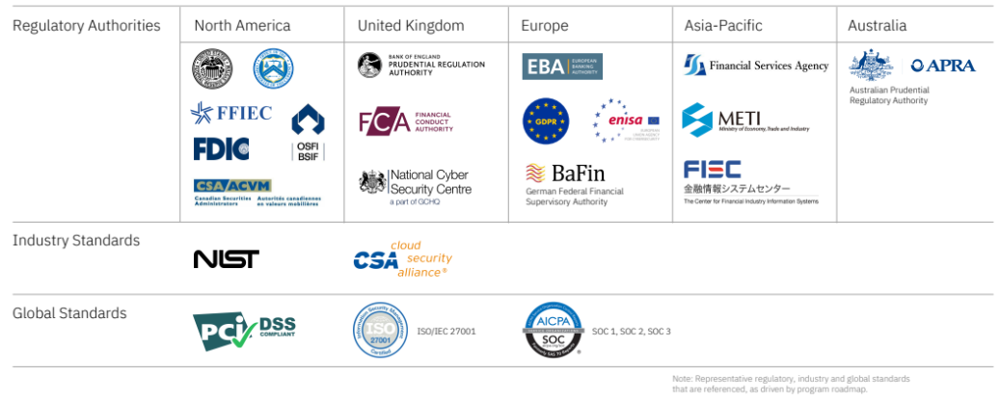

# IBM Cloud for Financial Services

**IBM Cloud for Financial Services®** is designed to help clients mitigate risk and accelerate cloud adoption for even their most sensitive workloads. Security and controls are built into the platform to enable financial institutions to automate their security and compliance posture, and make it easier for clients to simplify their risk management and demonstrate regulatory compliance postures.

## What it is

The IBM Cloud for Financial Services is a platform and ecosystem program designed to enable financial institutions and their partners to confidently host applications and workloads in the public cloud. IBM Cloud for Financial Services is not a separate cloud from IBM’s public cloud offering, but a platform and set of capabilities IBM has implemented on IBM Cloud on a framework of security and compliance that enables financial institutions to move to the cloud with confidence. 

IBM Cloud for Financial Services is comprised of IBM Cloud catalog services and [ISV applications]
(https://cloud.ibm.com/catalog?search=label%3Asupport_third_party) that comply with the IBM Cloud Framework for Financial Services. All products and services offered through IBM Cloud for Financial Services must be from validated sources. Only ISVs, SaaS providers, and other vendors that have demonstrated compliance with the IBM Cloud Framework for Financial Services are eligible to deliver their offerings through IBM Cloud for Financial Services.

## IBM Financial Services Cloud Council

Invitation-only, peer community for Senior Executives from Financial Institutions, leading a 
focused effort designed to help: 

- Reduce the risk of using “the cloud” across the financial services industry and ecosystem
- Contribute to the advancement of a financial services cloud framework and associated practices
- Enable ongoing collaboration among industry peers in confidential environments to share what is required to succeed in a regulated marketplace 
- Engage with regulators, who are increasingly focusing on cloud strategies, governance, and operations

The council convenes quarterly within these groups, and in cross-council working groups and special sessions.

- It comprises of 90+ global and regional banking leaders representing 60+ firms. 
- Insights gained from the council inform and influence IBM Cloud Framework for Financial Services. 
Together, the council membership is driving an innovative new construct for public cloud, designed 
to help enable cloud adoption for mission critical workloads.

## Compliance

The [IBM Cloud for Financial Services Agreed Upon Procedures (AUP) Report](https://www.ibm.com/cloud/blog/building-confidence-independent-review-of-ibm-cloud-for-financial-services) was commissioned by IBM and completed by a “Big Four” public accounting firm in accordance with the American Institute of Certified Public Accountants (AICPA). The report demonstrates to  IBM Cloud for Financial Services clients that IBM Cloud services have been implemented against, and adhere to, the IBM Cloud Framework for Financial Services technical, administrative and physical control requirements.

The report addresses controls for all Focus Areas of the IBM Cloud Framework for Financial Services including:

- Active Monitoring & Response
- Advanced Data Protection
- Automated Application & Workload Protection
- Enhanced Authentication & Access Management
- Focused Risk Management & Compliance
- Operational Excellence
- Unified Infrastructure Security & Resilience

The following diagram shows a representative regulatory, industry and global standards driven by program roadmap.

## Next steps

See:

- [IBM Cloud for Financial Services Whitepaper](https://www.ibm.com/downloads/cas/JYB6MQRB)
- [IBM Cloud® compliance: IBM Cloud for Financial Services®](https://www.ibm.com/cloud/compliance/ibm-cloud-for-financial-services)

## References

- Product page: [IBM Cloud for Financial Services](https://www.ibm.com/cloud/financial-services)
- [Confidential computing on IBM Cloud](https://www.ibm.com/cloud/confidential-computing)
- [New report validates IBM Cloud services are implemented against, and adhere to, the IBM Cloud Framework for Financial Services](https://www.ibm.com/blog/building-confidence-independent-review-of-ibm-cloud-for-financial-services/)