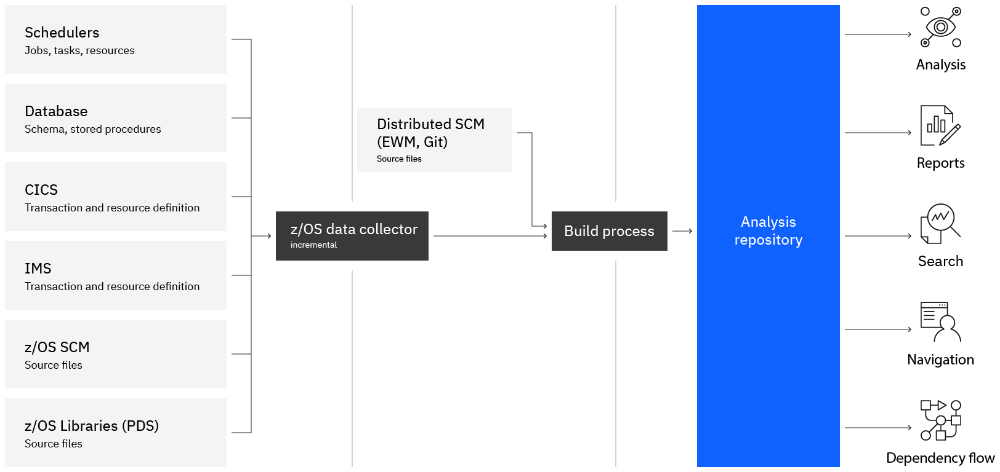

# IBM Application Discovery and Delivery Intelligence (ADDI)

With millions of lines of code, hundreds of dependencies, and dated documentation, developers can spend weeks or months trying to understand all the changes needed with no guarantee the updates won’t break something.

**IBM Application Discovery and Delivery Intelligence (ADDI)** is an analysis tool that helps you visualize applications, data, and jobs on z/OS®. ADDI enables architects and developers to discover dependencies in a click, make changes with confidence, and keep documentation current and accurate. Use ADDI to enable your IT teams to make informed decisions about modernizing, consolidating, or decommissioning applications.

## Business value

- **Boost potential profitability**
Developer productivity is increased by 20–30%, providing more time for innovation[^1].
- **Achieve positive ROI fast**
Clients using ADDI were able to achieve an ROI of 163% over three years, with an average payback period of under one year¹.
- **Faster time to market with quality**
Cost saving of up to 10% due to infrastructure consolidation¹.
- **Embrace the hybrid cloud**
Evolve systems and applications rapidly to take advantage of hybrid cloud.
- **Improve business alignment**
Visualize existing applications to derive requirements for enhanced user story creation.

## Discovery pattern

An analysis tool such as IBM® Application Discovery and Delivery Intelligence (ADDI) provides up-to-date, consumable information about your mainframe software assets and resources. Architects and developers can visualize application flow, perform impact analysis, and generate reports to act on their modernization strategy and plan increments with confidence.

**Gathering the analysis data is the first step of the process**. This data is built in a similar manner as when the source code is compiled. The purpose of this build process is not to produce an executable module, but to assemble and resolve data and logic flows so that they can be reviewed, measured, and reported.

**Using the data from the repository is the second step for the process**. The repository will be accessed by different tools to support several workflows: provide metrics, browse artifacts, perform impact analysis, and display graphs with different levels of details and focus. Typically, developers and architects will perform these workflows in their Eclipse-based Integrated Development Environment (IDE). Other team members may use web browsers or some of the many reports that can be generated. Teams can also use the provided APIs to support automation scenarios, to implement gates in a pipeline, or to feed various dashboards.

## Getting started

With IBM ADDI, you can leverage the capabilities of the following components to speed up your application modernization.

- [IBM Application Discovery for IBM Z (IBM AD)](https://www.ibm.com/docs/en/addi/6.1.2?topic=getting-started#getting_started__get_started_ad__title__1) is an Eclipse-based static code analysis solution that fast-tracks the discovery and analysis phases of System z®/Enterprise Software work. It is used for application understanding and provides visualization of dependencies, flows, usage, and impacts. For more information, see [IBM AD User Guide](https://www.ibm.com/docs/en/addi/6.1.2?topic=ad-user-guide).
- [IBM Wazi Analyze](https://www.ibm.com/docs/en/addi/6.1.2?topic=getting-started#getting_started__wazi_analyze__title__1) is a containerized component that creates rapid, graphical analysis in an installation-free and configuration-free web UI. With Wazi Analyze, developers can discover the relationships among their z/OS application artifacts and quickly understand the impact of the changes to make. 

    - To quickly get started with Wazi Analyze and explore its key features, see [Checklist for getting started](https://www.ibm.com/docs/en/SSRR9Q_6.1.2/com.ibm.wazi.analyze.doc/topics/get_started.html).
    - If an earlier version of Wazi Analyze is installed, follow the instructions in Migrating to a newer version to migrate.
    - For a complete user guide of Wazi Analyze, see [IBM Wazi Analyze User Guide](https://www.ibm.com/docs/en/addi/6.1.2?topic=wazi-analyze-user-guide).

For a deep dive, see [Wazi Analyze](./analyze.md) in this wiki.

## Next steps

See Forrester report [The Total Economic Impact™ Of IBM ADDI](https://www.ibm.com/downloads/cas/XJQYLRVG).

The following videos and courses can help build your skills with ADDI.

### Series of videos

See set of 17 videos each shorter than 10 minutes, that describe ADDI, Wazi analyze, integration with Git, and the steps to using the products. [Discovery and Analysis](https://mediacenter.ibm.com/playlist/details/1_g0oviokq/categoryId/189147203).

### Online courses

[Application Discovery & Delivery Intelligence (ADDI) Essentials](https://learn.ibm.com/course/view.php?id=7680). This badge earner understands foundational knowledge of ADDI (IBM Application Discovery and Delivery Intelligence) - a static source analysis solution for application modernization. The earner has gained key insights on how It uses cognitive technologies to analyze mainframe applications to quickly discover, as well as the inter-dependencies and impacts of change.

[Accelerator - Application Discovery & Delivery Intelligence (ADDI)](https://community.ibm.com/community/user/ibmz-and-linuxone/groups/community-home/librarydocuments/viewdocument?DocumentKey=4cb329ed-1515-45f1-8ec3-9c72df457ced) shows how to use ADDI, Wazi Analyze, and provides link to ADDI trial to work through scenarios.

### Product trial

See [IBM Application Discovery and Delivery Intelligence (ADDI) IBM Z Trial](https://early-access.ibm.com/software/support/trial/cst/welcomepage.wss?siteId=924&tabId=2188&w=1).

## References

- [IBM Application Discovery and Delivery Intelligence](https://www.ibm.com/products/app-discovery-and-delivery-intelligence). This course is designed to provide the audience with an introduction to IBM Application Discovery and Delivery Intelligence (ADDI).
- [IBM Application Discovery and Delivery Intelligence for IBM Z documentation](https://www.ibm.com/docs/en/addi).
- Architecture center: [Application discovery for business alignment pattern](https://www.ibm.com/cloud/architecture/architectures/z-application-discovery-pattern)

### IBM Partners

- [ADDI Solution Brief](https://ibm.seismic.com/Link/Content/DCB79QfdDF2948TH729dgWpB2q8d)

## Contributors

- Rami Katan &dash; STSM, Chief Architect for zDevOps AI & ML Systems IBM
- Nicolas Dangeville &dash; STSM - Chief Architect for ADDI
- Joydeep Banerjee &dash; Associate Partner and Offering Manager Mainframe Application Modernization Consulting IBM

[^1]:
    [The Total Economic Impact™ of IBM ADDI](https://www.ibm.com/account/reg/signup?formid=urx-51352), October 2021 is a Forrester Consulting study commissioned by IBM.