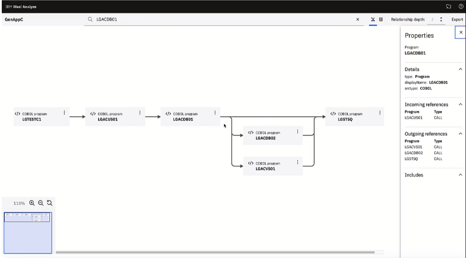

# Wazi Analyze

Use **IBM® Wazi Analyze** to create rapid, graphical analysis in an installation-free and configuration-free web UI. It is a containerized component that brings rapid analysis capability to developers to help them discover the relationships between the components of their z/OS applications and to understand the impact of potential changes. It provides a graphical visualization of COBOL application artifact dependencies in a web user interface. 

!!! Key

    Use Wazi Analyze developers to discover the relationships among their z/OS application artifacts and quickly understand the impact of changes they want to make.

Anticipating the potential impact of changes and reducing the risks before they actually happen could be essential for increasing the productivity and agility of developers. Developers need to do rapid scans for analysis of an application and assess the impact of changes. This is where IBM Wazi Analyze comes in.

Wazi Analyze is available as a containerized component that helps you understand the impact of programs and files changes through graphical analysis. With this web-based and pre-installed application that is delivered in a Docker container, you can rapidly scan your source files and view the impact analysis through an easy-to-use web user interface.

## Impact analysis

Wazi Analyze supports the following types of impact analysis.

- Program call references that display the call relationship between COBOL programs.
- Source file references that display the relationship between COBOL files and COBOL included files.

The following illustration shows a screenshot of the demo application GenAppC.

## Deployment

Choose one of the following Wazi Analyze containers to deploy and use.

- Wazi Analyze container on Linux®
- Wazi Analyze container on Linux on IBM Z®

You can install Docker and load the Wazi Analyze Docker container on your desktop. When you want to make changes to your source code, Wazi Analyze helps you quickly discover the relationship between files or relationship between programs of the COBOL application.

## Steps in using Wazi Analyze

- [Checklist for getting started](https://www.ibm.com/docs/en/SSRR9Q_6.1.2/com.ibm.wazi.analyze.doc/topics/get_started.html). Refer to the checklist to quickly get started with Wazi Analyze.
- [Deploying Wazi Analyze](https://www.ibm.com/docs/en/SSRR9Q_6.1.2/com.ibm.wazi.analyze.doc/topics/deploy_wa_parent.html). Learn how to deploy Wazi Analyze to your local machine.
- [Creating a project](https://www.ibm.com/docs/en/SSRR9Q_6.1.2/com.ibm.wazi.analyze.doc/topics/create_a_project.html). Besides the projects that are shipped along with Wazi Analyze, you can create a project as needed.
- [Preparing the source files to be scanned](https://www.ibm.com/docs/en/SSRR9Q_6.1.2/com.ibm.wazi.analyze.doc/topics/prepare_the_source_files_to_be_scanned.html). Learn how to prepare the source files before you transfer them to the Wazi Analyze container for scanning and analysis.
- [Scanning the source files](https://www.ibm.com/docs/en/SSRR9Q_6.1.2/com.ibm.wazi.analyze.doc/topics/scan_source_files.html). After you prepare all the source files, you can start to scan the source files and check the scan results from log files.
- [Starting up and shutting down the server](https://www.ibm.com/docs/en/SSRR9Q_6.1.2/com.ibm.wazi.analyze.doc/topics/start_up_and_shut_down_server.html). Check the following instructions to learn how to start up and shut down the Wazi Analyze server.
- [Viewing the missing artifacts report](https://www.ibm.com/docs/en/SSRR9Q_6.1.2/com.ibm.wazi.analyze.doc/topics/view_missing_artifacts_report.html). After you scan the source files, you can check if any included files or programs are missing from the source directory of your project for scanning through the missing artifacts report.
- [Viewing impact analysis results](https://www.ibm.com/docs/en/SSRR9Q_6.1.2/com.ibm.wazi.analyze.doc/topics/view_impact_analysis_results.html). Learn how to view the impact analysis results of your scan through the Wazi Analyze web user interface.
- [Viewing the dataflow analysis](https://www.ibm.com/docs/en/SSRR9Q_6.1.2/com.ibm.wazi.analyze.doc/topics/view_data_flow_analysis.html). Wazi Analyze supports dataflow analysis through web user interface for COBOL, PL/I, Assembler, and C languages. Learn how to view the dataflow analysis of your scan through the Wazi Analyze web user interface.
- [Exporting analysis results](https://www.ibm.com/docs/en/SSRR9Q_6.1.2/com.ibm.wazi.analyze.doc/topics/export_impact_analysis_results.html). Check the following instructions and learn how to export the analysis results into a JSON file, a PDF file, or a YAML file.

For more information, see [IBM Wazi Analyze User Guide](https://www.ibm.com/docs/en/addi/6.1.2?topic=wazi-analyze-user-guide).

## Checklists

As a web-based application that is pre-installed and delivered in a container running on Linux®, Wazi Analyze is available as the following options:

- An IBM Wazi for Dev Spaces stack in the OpenShift Container Platform environment
- A stand-alone container that can be run using Docker or Podman

See [Checklist for getting started](https://www.ibm.com/docs/en/cloud-paks/z-modernization-stack/2023.4?topic=started-getting-wazi-analyze). 

- [Checklist for Wazi Analysis for Dev Spaces on OpenShift](https://www.ibm.com/docs/en/SSV97FN_2022.1.1/wazidoc/com.ibm.wazi.analyze.doc/topics/get_started.html#getstarted__sidecar)
- [Checklist for Wazi Analysis for desktop container](https://www.ibm.com/docs/en/cloud-paks/z-modernization-stack/2023.4?topic=started-getting-wazi-analyze#getstarted__docker)

## Next steps

Learn more about Wazi Analyze.

### Video

See [Introducing IBM® Wazi Analyze](https://mediacenter.ibm.com/media/Introducing+IBM%C2%AE+Wazi+Analyze+/1_n6v6smr4/189012293) video.

### Tutorials

- [Tutorial: Performing impact analysis of GenAppC, a demo project](https://www.ibm.com/docs/en/SSRR9Q_6.1.2/com.ibm.wazi.analyze.doc/topics/view_the_sample_project_genapp.html). Wazi Analyze provides GenAppC as a demo project that you can easily scan to view its analysis results. Learn how to get started with GenAppC and perform the analysis of the GenAppC scanned results.
- [Tutorial: Updating the scan options for the GenAppC project](https://www.ibm.com/docs/en/SSRR9Q_6.1.2/com.ibm.wazi.analyze.doc/topics/tutorial_update_scan_options_for_genapp.html). Learn how to update a scan option for the GenAppC project and then observe the changes to the scan results after your update.

## References

- [IBM Wazi Analyze User Guide](https://www.ibm.com/docs/en/addi/6.1.2?topic=wazi-analyze-user-guide)
- [Accelerating your application discovery and analysis with IBM ADDI](https://community.ibm.com/community/user/ibmz-and-linuxone/blogs/fiona-wang1/2021/03/19/whats-new-in-ibm-addi-v600)