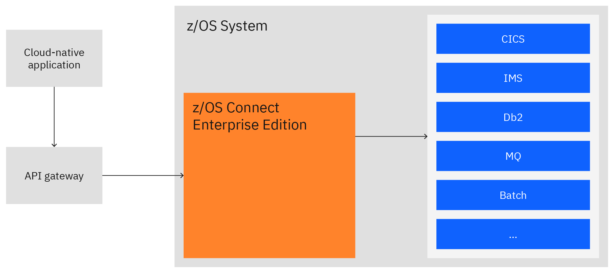
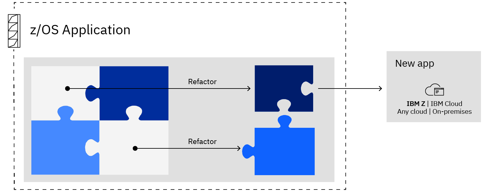
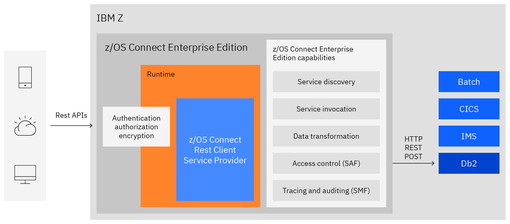
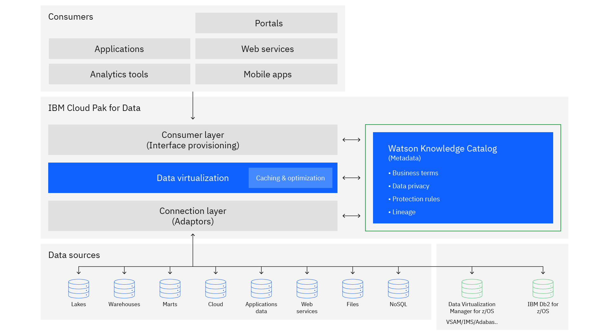
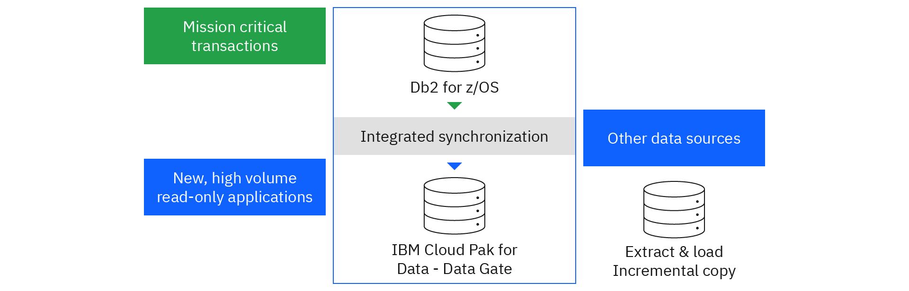
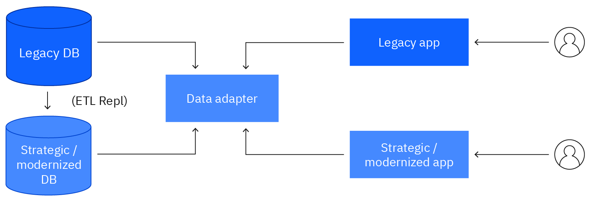
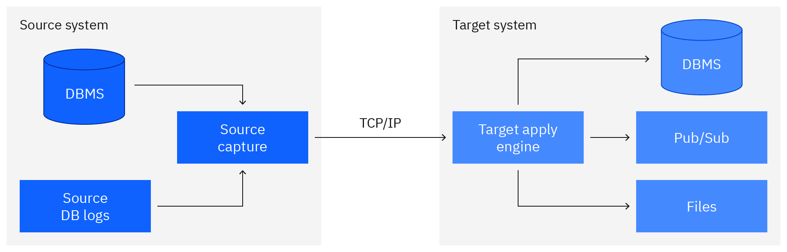
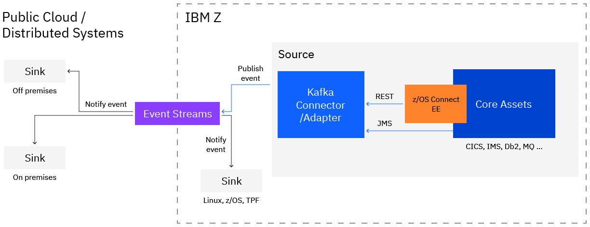
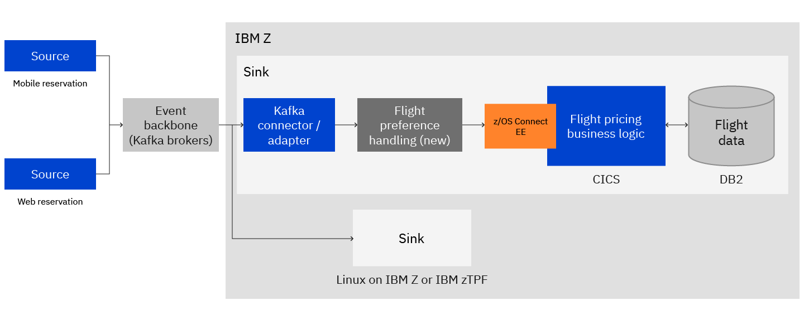
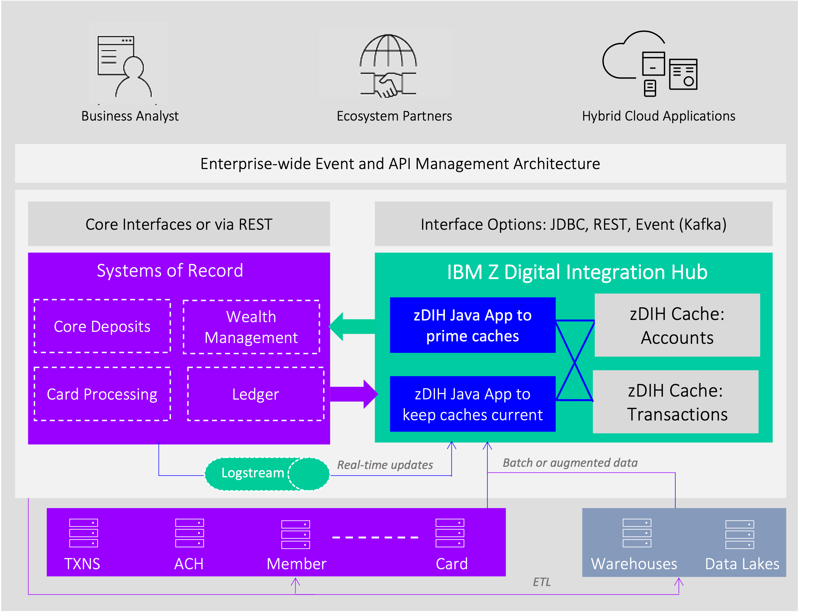

# IBM zSystems application modernization patterns

Patterns represent architectural best practices for specific business challenges. Each pattern directly addresses business challenges and provides a path to incremental and independent adoption for customers. These application modernization patterns cover aspects that are specific to IBM Z and common patterns that are applicable to all platforms but specialized for IBM Z.

This page summarizes the article [Application modernization for IBM Z architecture](https://www.ibm.com/cloud/architecture/architectures/application-modernization-mainframe/patterns).

## Modernization patterns categories

Based on common characteristics, the patterns for IBM Z application modernization can be divided into four categories, as shown in the diagram.

- [Application centric](#application-centric)
- [Data-integration centric](#data-centric-integration)
- [Event driven](#event-driven)
- [Lifecycle enablers](#lifecycle-enablers)

The following diagram summarizes the patterns.

## Application centric

Drive enhanced function and flexibility through new application components that are developed as cloud-native functions, which either extend or enhance application components. New application components can either invoke applications on IBM Z or the applications can also invoke these new cloud-native functions.

### Expose through APIs

Access mainframe applications and data by using standards-based REST APIs with IBM® z/OS® Connect EE. Manage APIs by using industry-standard API management solutions, including solutions by IBM.

The following diagram shows the components that are involved in invoking a mainframe application that is exposed as an API. In the simplified flow example, a cloud-native application invokes an API that is managed, secured, and exposed by an enterprise API management system that uses an API gateway.

For details of the pattern, see:

- [Expose through APIs pattern](https://www.ibm.com/cloud/architecture/architectures/z-expose-apis-pattern)
- [API for Z](./api.md) in this wiki

### Extend with a new function

Extend core applications on IBM z/OS with a new function using a Cloud-native application or other implementation approaches

Augment core applications on IBM z/OS with new cloud-native components that are integrated through REST APIs. The cloud-native application can be pre-existing or developed by using enterprise DevOps and containers that run on IBM z/OS or IBM LinuxONE.

IBM zSystems provides multiple options to deploy a cloud-native application as shown in the following diagram.

Available on Linux on Z or LinuxONE:

- **Containers on IBM Z and LinuxONE**. Containers which enable multiple encapsulated workloads to run on a single Linux instance are available on IBM Z and LinuxONE.
- **Red Hat OpenShift for IBM Z and LinuxONE**. Red Hat OpenShift provides a trusted Kubernetes enterprise platform that supports modern, hybrid-cloud application development and provides a consistent foundation on IBM zSystems and LinuxONE.

Available on z/OS:

- **IBM z/OS Container Extensions (zCX)**. zCX is a new feature of z/OS 2.4 that expands and modernizes the z/OS software ecosystem by allowing applications and workloads built for Linux on Z and packaged into a Docker image to run on z/OS.
- **IBM zCX Foundation for Red Hat OpenShift (zCX for OpenShift)**. zCX for OpenShift provides the capability to run Red Hat OpenShift on z/OS, using IBM z/OS Container Extensions. Red Hat OpenShift provides open, enterprise-level, cloud-native tools and orchestration capabilities for your hybrid cloud architecture on z/OS.

For details of this pattern, see:

- [Extend with a new function pattern](https://www.ibm.com/cloud/architecture/architectures/z-extend-cloud-native-pattern)

### Co-locate applications

Collocate applications on IBM Z in a container that can access existing data or applications with order of magnitude reduced latency to meet SLA objectives.

IBM zSystems provides the runtime environment to run both cloud-native applications as well as for migrating existing distributed applications to IBM zSystems. Thus, collocating supporting applications on the same platform as core SOR applications can reduce latency across these components as shown in the following diagram. 

Additionally, IBM zSystems supports development of new functions as cloud-native applications by providing tools and runtime capabilities for easily extending existing applications to invoke external APIs for cloud-native applications.

For more information, see [Collocate applications pattern](https://www.ibm.com/cloud/architecture/architectures/z-collocate-applications-pattern)

### Enhance existing function

Incrementally rewrite a part of a mainframe application driven by an immediate business need. Use cloud-native principles, enterprise DevOps, modern languages, and container technology on IBM z/OS or IBM LinuxONE. Integrate new functions by using APIs to or from assets by using the co-existence model.

While the business drivers and starting points for enhancing an existing function are different from the pattern for extending with a new function, the solution approaches for developing enhanced function follow the same scenarios:

- Rewrite as cloud-native application for API-based integration
- Rewrite using open-enterprise language-based function and collocate on the same environment as the existing application for tighter integration
- Replace with a packaged solution and integrate with APIs
- Redeploy an existing COBOL based application on Cloud with a hybrid-cloud architecture

For more information, see [Enhance an existing function pattern](https://www.ibm.com/cloud/architecture/architectures/z-enhance-cloud-native-pattern)

### Refactor into discrete services

Refactor functions into reuseable components for agile development and sharing by applications.

The "Refactor into discrete services" pattern shows the process and components that are involved to refactor functions into reuseable components so that they can be used by both existing and new applications.

For more information, see:

- [Refactor into discrete services pattern](https://www.ibm.com/cloud/architecture/architectures/z-refactor-discrete-services-pattern).
- [IBM watsonx Code Assistant for Z (AI-assisted Mainframe Application Modernization)](watsonxcodeassist.md) in this wiki.

For information on tooling, see:

- [IBM Application Discovery and Delivery Intelligence (ADDI)](./addi.md)
- [Wazi Code](./wazicode.md)

## Data-centric integration

Gain data-driven business value as applications share system-of-record (SOR) data either through direct access, replication, caching, or data virtualization concepts that combine data assets across the enterprise.

### Enable modern access to IBM Z data

Provide modern support for accessing IBM Z data through SQL-based query and through REST APIs. Simplify new application development by using this modern data access without disrupting data management and recovery processes on IBM Z to maintain data consistency.

IBM Z supports modern access to real-time transactional data in IBM® Db2®, IMS, and other data sources. Db2 and IMS can be accessed through SQL and REST API by using [IBM® z/OS® Connect EE](https://www.ibm.com/products/zos-connect-enterprise-edition). Other data sources can be accessed through SQL or REST API by using [IBM® Data Virtualization Manager for z/OS®](https://www.ibm.com/products/data-virtualization-manager-for-zos) along with z/OS Connect EE.

The following diagram shows how you can invoke Db2 native RESTful services from z/OS Connect EE by using the z/OS Connect EE REST Client Service Provider.

For more information, see [Enable modern access to IBM Z data pattern](https://www.ibm.com/cloud/architecture/architectures/z-enable-modern-access-pattern)

### Virtualize IBM Z data

Access data across IBM Z and other data sources, including joining data, without the need to copy and replicate that data. Deliver more current and accurate data with in-place data access to consuming applications, including analytics.

The foundation for accessing data across disparate data sources is the [IBM Watson® Knowledge Catalog](https://www.ibm.com/cloud/watson-knowledge-catalog) in IBM Cloud Pak for Data. It is more feasible and less costly to maintain metadata across different data sources instead of constantly moving terabytes of changing data. 

As shown in the following diagram, in Watson Knowledge Catalog, you can discover, govern, and catalog the metadata of IBM Z data that is stored in Data Virtualization Manager for z/OS and Db2 for z/OS.

Watson Knowledge Catalog is a data catalog tool that powers the intelligent, self-service discovery of data structures, models, and more. You can access, curate, categorize, and share data, knowledge assets, and their relationships wherever they are, backed by active metadata and policy management. The cloud-based enterprise metadata repository also activates information for AI, machine learning (ML), and deep learning. As shown in the following diagram, in Watson Knowledge Catalog, you can discover, govern, and catalog the metadata of IBM Z data that is stored in Data Virtualization Manager for z/OS and Db2 for z/OS.

For more information, see [Virtualize IBM Z data pattern](https://www.ibm.com/cloud/architecture/architectures/z-virtualize-ibm-z-data-pattern)

### Cache IBM Z data

Improve application response time and scalability by storing optimized copies of IBM Z data. Free compute resources and increase throughput by offloading application logic to the caching layer, especially for read-heavy applications.

The IBM vision is for modern applications to share an integrated infrastructure with mission-critical transactional applications, without the need to build custom integration. That vision supports an integrated infrastructure that doesn't require access to the same copy of the transactional data. Db2 Data Gate delivers an integrated approach for your digital transformation without the need to be concerned about potential cost or workload implications on your operational systems.

This example shows an integrated approach to enterprise digital transformation:

IBM Db2 for z/OS Data Gate can help you with this specific challenge regarding Db2 data on IBM Z. You can derive value faster from data that is generated through mission-critical applications that run on Db2 for z/OS. The solution uses technology to manage the replication and synchronization between the source and target. The source data always remains secure on IBM Z, and all insert, update, and delete actions are completed in Db2 for z/OS.

For more information, see [Cache IBM Z data pattern](https://www.ibm.com/cloud/architecture/architectures/z-cache-ibm-z-data-pattern).

### Transform IBM Z data

Incrementally build new modernized systems-of-record (SOR) data stores by tapping into IBM Z data traffic through a data adapter to transform to the modernized data format.

In the following simplified depiction, the transformation processes are indicated by the Data Adapter box. In practice, these transformations can span both processes and time.

For more details on the choices and techniques, see [Transform IBM Z data](https://www.ibm.com/cloud/architecture/architectures/z-transform-data-pattern).

### Replicate IBM Z data

Replicate data in real time by capturing change log activity to drive changes in the target. Enable newer applications to access a broader range of data stores and access methods through replication.

The following diagram is a simplified depiction of a replication setup from a source DBMS to either a target DBMS, a publish/subscribe such as Kafka, or a file system:

For more details and considerations, see [Replicate IBM Z data](https://www.ibm.com/cloud/architecture/architectures/z-replicate-data-pattern).

## Event driven

 Leverage dynamic interaction between loosely coupled applications, applications, and new cloud-native applications, exchanging information through events to improve performance and experience.

### Respond to IBM Z application events

This pattern is a specialization of the broader [event sourcing pattern](https://www.ibm.com/cloud/architecture/architectures/event-driven-event-sourcing-pattern) for the integration of two or more silos of applications through event-based loose coupling. In event-based loose coupling, an event is raised by an application and delivered by an event stream infrastructure to other interested applications to complete follow-up actions.

In this specialized pattern for IBM Z application modernization, the source of an event is a core application that is based on IBM Z. The event is notified to one or more down-stream applications that run on IBM Z or on another platform, such as a public cloud.

For details, see [Respond to Z application events pattern](https://www.ibm.com/cloud/architecture/architectures/z-respond-to-z-app-events-pattern).

### Respond to external events

Share events that are generated by applications that are external to IBM Z to drive the invocation of IBM Z application logic. Develop flexible logic without introducing risks in core applications.

The following diagram shows am event-driven implementation for the new service.

For more information, see [Respond to external events pattern](https://www.ibm.com/cloud/architecture/architectures/z-respond-external-events-pattern).

### Optimize CQRS

Deliver an efficient CQRS system that is based on IBM Z to optimize the synchronization between the command access, which is SOR data that is updated by online and batch applications, and the query access, which is an information model that is aligned with the needs of the new applications. Optimize by using IBM Z Digital Integration Hub to deliver a non-disruptive, low-latency, high-throughput, and cost-attractive solution.

The following diagram depicts a technical component overview for an implementation of this pattern.

The approach in this pattern is to first create an optimized aggregation of the relevant information, as opposed to moving all of the raw data from systems of record. Then, you surface that information through various standards-based interfaces, including through event-based mechanisms such as Kafka. 

For more information, see [Optimize CQRS pattern](https://www.ibm.com/cloud/architecture/architectures/z-optimize-cqrs-pattern).

## Lifecycle enablers

Derive deeper insights about the environment and enable agile solution development through techniques and tools that support DevOps practices and software pipelines.

### Application discovery

Extract consumable information about your software assets and build an inventory of applications and their resource usage and dependencies. Visualize information flow across application components, perform impact analysis, and generate reports to act on your modernization strategy and plan increments with confidence.

Gathering the analysis data is the first step of the process: This data is built in a similar manner as when the source code is compiled. The purpose of this build process is not to produce an executable module, but to assemble and resolve data and logic flows so that they can be reviewed, measured, and reported.

The following diagram shows an architecture supporting the gathering analysis data.

An analysis tool such as [IBM® Application Discovery and Delivery Intelligence (ADDI)](https://www.ibm.com/products/app-discovery-and-delivery-intelligence) provides up-to-date, consumable information about your mainframe software assets and resources. Architects and developers can visualize application flow, perform impact analysis, and generate reports to act on their modernization strategy and plan increments with confidence.

For more information, see:

- [Application discovery for business alignment pattern](https://www.ibm.com/cloud/architecture/architectures/z-application-discovery-pattern).
- [IBM Application Discovery and Delivery Intelligence (ADDI)](./addi.md) in this wiki.

### Enterprise DevOps

Provide a cloud-native developer experience for IBM Z by fully integrating IBM Z development into enterprise continuous integration, continuous delivery (CICD) pipelines and embracing consistent open-source tools that are familiar to all developers.

The following diagram shows how IBM zSystems® should be an integral part of the Enterprise DevOps strategy. 

DevOps is a way of working that drives a culture of continuous learning, continuous improvement, transparency, visibility, and trust. 

For a deeper dive, see:

- [Enterprise DevOps pattern](https://www.ibm.com/cloud/architecture/architectures/z-enterprise-devops-pattern)
- [A modern DevOps platform for mainframe applications with IBM Cloud](./devops.md) in this wiki

## References

- [Application modernization for IBM Z architecture](https://www.ibm.com/cloud/architecture/architectures/application-modernization-mainframe/patterns)