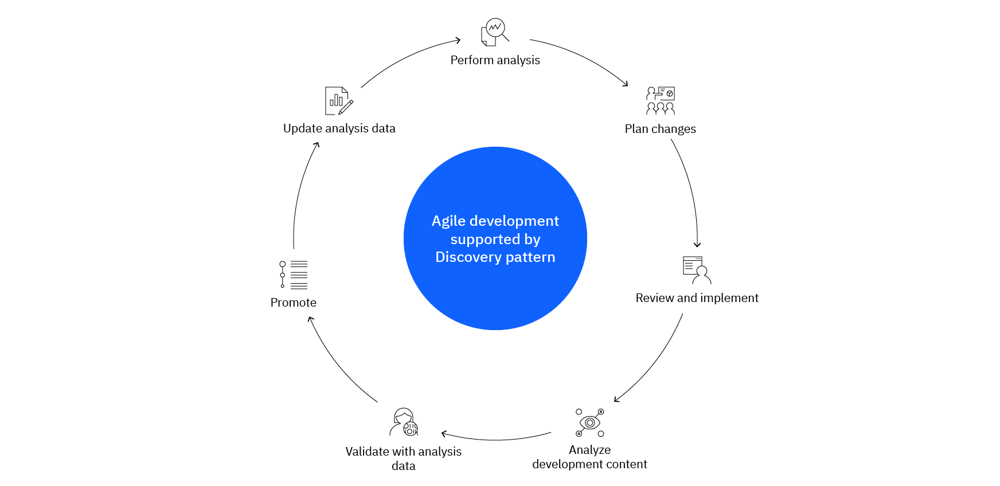

# Application discovery pattern

Organizations rely on core applications that maintain system-of-record (SOR) data on the mainframe. Online and batch programs within these applications contain business logic to maintain data integrity across business entities and to implement business policies, processes, and rules and these are the core business assets of an organization. IBM zSystems’ strict backward compatibility ensures that these core assets can remain in use even with evolving technology. Hence these transactional and batch applications that were often designed decades ago and have evolved over the years to become very large and complex are difficult to understand and often have the tacit knowledge lost. However, in response to ongoing business needs, they need to continue to evolve, more quickly than ever. This requires a framework of rapid application understanding.

Application discovery can support a wide spectrum of modernization activities and hence it is important to understand the objectives of discovery. Here are a few:

- Have a high-level understanding of the portfolio and how applications in the portfolio integrate.
- Have a deep understanding of how a particular application works: how the programs are connected to each other, which data they manipulate, etc. This enables maintenance or new features in the application.
- Understand how a particular modernization activity (like performance improvement, SCM migration etc.) can be undertaken.
- Based on the objective, practitioners will choose a particular discovery entry point.

## Business needs

Let’s review a couple of business needs for analysis:

### Understand your applications for maintenance and new services

Organizations often face challenges regarding the development and maintenance of their mainframe applications. Mainframe applications typically have been developed over several decades and as a result the knowledge of these applications is not at the same level as it is with more recently developed applications. The architecture across the applications may be uneven, or some layers were added to solve a problem but have persisted ever since. Now, no one dares to touch these areas anymore. In a nutshell, it becomes a challenge to nurture application knowledge at a high enough level to perform what the business expects from the team.

As a result, the changes are done with uncertainty and risk. Sometimes this leads projects to derail or fail at an alarming rate. Even routine maintenance becomes harder: velocity of application maintenance is dropping.

Analysis helps developers, architects and business analyst to take back ownership of their code, to understand how the different pieces interact, to understand the data model involved. It provides up to date information with a given version of the application that very likely differs from what has been documented by the team in the past. It gives the knowledge needed to perform maintenance or implement a new feature.

### Identify APIs and expose services

Discover Code Segments that are aligned to certain Business functions or rules or Data Processing Algorithms that can be reused from different parts of the application landscape. These modular codes are the qualified candidates to be converted into APIs under in place modernization or for a rearchitected application. For example, a complex processing performed on a set of relational tables can be identified by tracking the usage of these tables in the code. Refactoring of the code can be performed to isolate the single business function and expose it.

### Standardize languages and technologies across applications

Traditional Mainframe applications developed long back often suffer from organizational standards and become aligned to the language / technology that the development team had been comfortable with. Over time, the technology might have become outdated, support have been costlier, or the availability of support resource have become scarce. Therefore, there is a need to align the applications to the most appropriate technology for the organization which aligns it to its future state. Inventory capabilities of analysis helps to plan the appropriate changes.

### Componentize your source code to adopt DevOps practices

Shorter cycle times help to get earlier feedback and reduce effort for corrective actions, but also involve building and deploying more frequently. Time to market reduction, or maintenance of simultaneous versions makes parallel development an imperative. Defining the right content of a git repository allows teams to work in parallel and establish clear interfaces and adoption processes when inter-related components evolve. Analysis is required to define these boundaries and identify interfaces.

### Performance analysis

TCO is considered one of the most important driving forces behind mainframe modernization. Lack of coding standards and software quality management processes, along with the growth of application data, usage of old and outdated software increases the MIPS consumption of mainframe applications which results in increased TCO directly or indirectly. Discovery of application components that can be optimized for reduced CPU usage and reduction of risks of failure are the focus areas for performance analysis. Software version upgrade, efficient code and processes, reduced batch cycles, decommissioning of unused or ineffective components are some of the results for performance analysis discovery of mainframe applications.

## Action plan

Static analysis is a method of application discovery that processes the source code and resource definitions without executing the code. It is performed on a version of the code and resources, typically the production version.

Because it is based on the source code and related definitions about the middleware, it reflects the reality of the implementation of the applications, their structure, program flow, control flow and data flow, and it helps teams regain control and plan changes more effectively.

1. Populate an analysis repository with a consistent set of software assets
2. Gathering the analysis data
3. Using the data from the repository conduct:

    - Runtime analysis
    - Performance analysis

## Business results

By applying the discovery and analysis pattern, organizations can accomplish different business targets, such as:

- React to disruption, regulations and business requirements with reduced risk and uncertainty.
- Take knowledge-based decisions to adopt DevOps practices, expose APIs, enable architecture changes and upgrade to hybrid cloud.
- Onboard new developers and build their application knowledge faster.
- Delegate projects to System Integrators (SIs) and internal teams with a clean bill of materials.

## Agile development cycle

Discovery and Analysis are part of an agile development cycle are shown in the following diagram.

The Modernization journey of a mainframe application starts with an understanding of the as-is applications using the available processes, techniques, and tools. The discovery processes depend upon the objectives of discovery – while some focus on the functional side of the application (e.g., API discovery) others focus on the technical aspects of the application (e.g., performance discovery). Correct application understanding ensures the selection of the correct levers for modernization to the desired target state. A trusted partner, like IBM Consulting, with wide advisory and execution experience helps to perform the right kind of discovery for the most desired modernization benefit.

## Next steps

An analysis tool such as [IBM® Application Discovery and Delivery Intelligence (ADDI)](https://www.ibm.com/products/app-discovery-and-delivery-intelligence) provides up-to-date, consumable information about your mainframe software assets and resources. Architects and developers can visualize application flow, perform impact analysis, and generate reports to act on their modernization strategy and plan increments with confidence.

Explore the tooling that support Discovery and Analytics. See [IBM® Application Discovery and Delivery Intelligence (ADDI) ](./addi.md) in this wiki.

## References

- [Application discovery for business alignment pattern](https://www.ibm.com/cloud/architecture/architectures/z-application-discovery-pattern)

## Contributors

- Rami Katan &dash; STSM, Chief Architect for zDevOps AI & ML Systems IBM
- Nicolas Dangeville &dash; STSM - Chief Architect for ADDI
- Joydeep Banerjee &dash; Associate Partner and Offering Manager Mainframe Application Modernization Consulting IBM