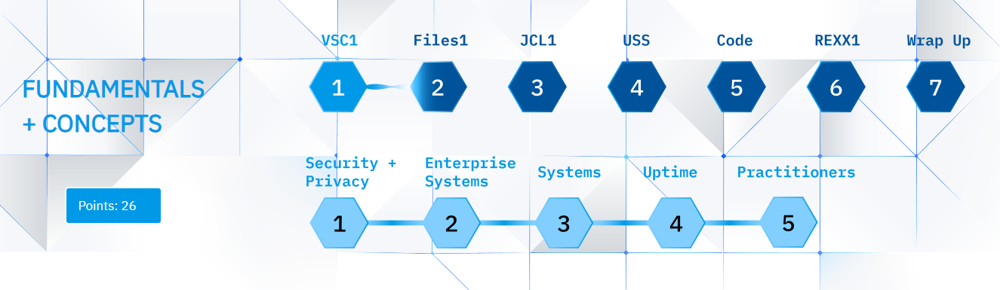

# Get started with modern mainframe development

**IBM Z Xplore learning platform** is a challenge-based learning platform available globally at no cost, with no prior knowledge required! You get hands-on experience to learn in-demand IBM Z® skills to help build a career in enterprise computing which powers 68% of all worldwide transactions. Earn digital badges that qualify you to participate in IBM Z Virtual Career Fairs and showcase your skills to employers. 

You will learn: 

- **Fundamentals and concepts:** Learn about data sets and coding languages such as JCL, Python, and USS using the VS Code modern application. Get introduced to IBM Z security, enterprise scalability and more.
- **Advanced:** Get hands-on learning around REXX, COBOL, Linux®, VSAM, REGEX, JCL, Python, Db2® and more.
- **Extended:** Expand your skills with hands-on learning around TSO/ISPF, Node.js, machine learning, Ansible® and more.

The following illustration maps out the fundamental journey.

## Hands-on mainframe learning

You’ll be communicating directly with a Logical Partition (LPAR) on one of the z15 machines. In other words, you get a piece of a z15 all to yourself. We want you to be able to learn as much as you want to on this platform, and you deserve to play on a real system.

You will use VS Code, an extensible editor made by Microsoft, to communicate with the mainframe. However, you can use APIs, custom apps, and terminals as another option as well. The software is available for Mac, Windows, and Linux. 

See [Visual Studio Code](https://code.visualstudio.com/docs/supporting/requirements) for your development system requirements.

## Get started

Sign up for [IBM Z Xplore](https://ibmzxplore.influitive.com/channels/1) and begin your journey.

## Badge

[IBM Z Xplore – Concepts](https://www.ibm.com/downloads/cas/lxgl0gd8) badge demonstrates that you have learned and displayed fundamental mainframe skills. This individual is able to perform everyday tasks in an IBM zSystems mainframe environment, including administering data sets, formulating commands, managing JCL, scripting actions in USS (UNIX® System Services), writing and debugging Python, and orchestrating actions through IBM zSystems Open Automation Utilities.

## Reference

- [IBM Z Xplore learning platform](https://www.ibm.com/z/resources/zxplore)
