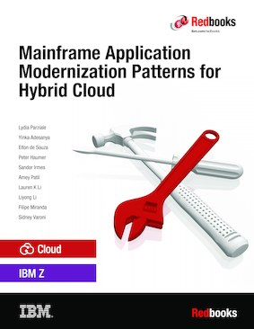

# Modern mainframe developer enablement roadmap

This article describes the steps you can take to learn how to get started learning to code on the mainframe.

- [Hands-on mainframe coding](#hands-on-mainframe-coding)
- [Learning Wazi concepts](#learn-wazi-concepts)
- [Learn DevOps](#learn-devops-as-a-service)
- [Mainframe development pattern](#ibm-redbooks-mainframe-application-modernization-patterns-for-hybrid-cloud)
- [Tutorials](#tutorials)

    - [Containers on Z](#containers-on-z)
    - [IBM Z and Cloud Modernization Stack](#hyper-protect-visual-server-for-vpc)

- [Hands on trials](#trials)

    - [OpenShift on LinuxONE](#try-openshift-on-linuxone)
    - [IBM Z and Cloud Modernization Stack](#checklist-for-ibm-z-and-cloud-modernization-stack)

## Hands-on mainframe coding

**IBM Z Xplore learning platform** is a challenge-based learning platform available globally at no cost, with no prior knowledge required! You get hands-on experience to learn in-demand IBM Z® skills to help build a career in enterprise computing which powers 68% of all worldwide transactions. Earn digital badges that qualify you to participate in IBM Z Virtual Career Fairs and showcase your skills to employers. 

You will learn: 

- **Fundamentals and concepts**. Learn about data sets and coding languages such as JCL, Python, and USS using the VS Code modern application. Get introduced to IBM Z security, enterprise scalability and more.
- **Advanced**. Get hands-on learning around REXX, COBOL, Linux®, VSAM, REGEX, JCL, Python, Db2® and more.
- **Extended**. Expand your skills with hands-on learning around TSO/ISPF, Node.js, machine learning, Ansible® and more.

The following illustration maps out the fundamental journey.

You’ll be communicating directly with a Logical Partition (LPAR) on one of the z15 machines. In other words, you get a piece of a z15 all to yourself. We want you to be able to learn as much as you want to on this platform, and you deserve to play on a real system.

You will use VS Code, an extensible editor made by Microsoft, to communicate with the mainframe. However, you can use APIs, custom apps, and terminals as another option as well. The software is available for Mac, Windows, and Linux. 

See [Visual Studio Code](https://code.visualstudio.com/docs/supporting/requirements) for your development system requirements.

### Get started

Sign up for [IBM Z Xplore](https://ibmzxplore.influitive.com/channels/1) and begin your journey.

### Badge

[IBM Z Xplore – Concepts](https://www.ibm.com/downloads/cas/lxgl0gd8) badge demonstrates that you have learned and displayed fundamental mainframe skills. This individual is able to perform everyday tasks in an IBM zSystems mainframe environment, including administering data sets, formulating commands, managing JCL, scripting actions in USS (UNIX® System Services), writing and debugging Python, and orchestrating actions through IBM zSystems Open Automation Utilities.

## Learn Wazi concepts

Next, learn the concepts of Wazi development.

[IBM Wazi Developer Fundamentals](https://yourlearning.ibm.com/credential/CREDLY-bf46e58b-5c2d-4112-8a90-cd6f2924bbee) badge earner has a good understanding of the capabilities, benefits and usage of Wazi Developer. This includes capabilities and benefits for Wazi Developers, how to use Wazi Developer, and how it supports J2C.

Upon completion of this course, you will be familiar with the following topics:

- Module 1 – Why Wazi Developer
- Module 2 – What is Wazi Developer
- Module 3 – How does it work
- Module 4 – Wazi Sandbox: Managing development and test environments
- Module 5 – Wazi Code: Developing applications with your choice of IDE
- Module 6 – Wazi Analyze: Understand the impact of changes with IBM Wazi
- Module 7 – Create a CI/CD pipeline for a z/OS application
- Module 8 – zTrial and Badge Quiz

## Learn DevOps as a Service

Learn about [Cloud Native Z DevOps as a Service](https://mediacenter.ibm.com/playlist/details/1_5q5qeehb/) in a series of step-by-step videos.

Each video in this series is shorter than ten minutes. Learn:

1. [IBM Wazi as a Service Overview](https://mediacenter.ibm.com/media/IBM%20Wazi%20as%20a%20Service%20Overview/1_xpoxgjsa)
2. [Managing an IBM Cloud Account](https://mediacenter.ibm.com/media/IBM%20Wazi%20as%20a%20Service%3B%20Managing%20an%20IBM%20Cloud%20Account/1_9agz7ap1)
3. [Creating a z/OS Virtual Server Instance](https://mediacenter.ibm.com/media/IBM%20Wazi%20as%20a%20Service%3B%20Creating%20a%20z_OS%20Virtual%20Server%20Instance/1_b8aircfl)
4. [Connecting a Virtual Server Instance (VSI)](https://mediacenter.ibm.com/media/IBM%20Wazi%20as%20a%20Service%3B%20Connecting%20a%20Virtual%20Server%20Instance%20(VSI)/1_vy4gl2nc)
5. [Azure DevOps for Mainframe Development with Wazi aaS](https://mediacenter.ibm.com/media/Azure%20DevOps%20for%20Mainframe%20Development%20with%20Wazi%20aaS/1_w7b5xzzy)
6. [Create a toolchain to secure z/OS application development in IBM Cloud](https://mediacenter.ibm.com/media/Create%20a%20toolchain%20to%20secure%20z_OS%20application%20development%20in%20IBM%20Cloud/1_ax4aw1hr)
7. [Running COBOL DBB Build Sessions with your VSI using IBM Wazi and VS Code](https://mediacenter.ibm.com/media/IBM%20Wazi%3B%20Running%20COBOL%20DBB%20Build%20Sessions%20with%20your%20VSI%20using%20IBM%20Wazi%20and%20VS%20Code/1_jnw8r2vp)
8. [Running a Debug Session with a Virtual Server Instance](https://mediacenter.ibm.com/media/IBM%20Wazi%20as%20a%20Service%3B%20Running%20a%20Debug%20Session%20with%20a%20Virtual%20Server%20Instance/1_5pfnbk24)
9. [Deploying and using Wazi Developer for Workspaces from an OpenShift Cluster in IBM Cloud](https://mediacenter.ibm.com/media/Wazi%20aaS%3B%20Deploying%20and%20using%20Wazi%20Developer%20for%20Workspaces%20from%20an%20OpenShift%20Cluster%20in%20IBM%20Cloud/1_ijmezvwu)
10. [Creating an Image](https://mediacenter.ibm.com/media/IBM%20Wazi%20as%20a%20Service%3B%20Creating%20an%20Image/1_7nwpwxxk)
11. [Creating a Component](https://mediacenter.ibm.com/media/IBM%20Wazi%20as%20a%20Service%3B%20Creating%20a%20%20Component/1_nipm2iwj)
12. [Creating a Source Environment](https://mediacenter.ibm.com/media/IBM%20Wazi%20as%20a%20Service%3B%20Creating%20a%20Source%20Environment/1_dp3ph9m0)
13. [Creating a Target Environment](https://mediacenter.ibm.com/media/IBM%20Wazi%20as%20a%20Service%3B%20Creating%20a%20Target%20Environment/1_jg1dyaif)
14. [Quickly creating a toolchain for z/OS with a CI pipeline](https://mediacenter.ibm.com/media/Quickly%20creating%20a%20toolchain%20for%20z_OS%20with%20a%20CI%20pipeline/1_5ev8jm2q)

## IBM Redbooks: Mainframe Application Modernization Patterns for Hybrid Cloud

IBM Z integrated into a hybrid cloud based on Red Hat OpenShift provides resiliency and secure architecture that allows for application workload placement on the "best fit" infrastructure to maximize scale, performance, and efficiency. You can accelerate application modernization today by using architectural patterns that are building blocks and best practices to learn how to implement and deploy application modernization in an IBM Z environment integrated with public cloud.

[**Mainframe Application Modernization Patterns for Hybrid Cloud**](https://www.redbooks.ibm.com/abstracts/sg248532.html) includes strategies and architectural solutions that can accelerate your mainframe application modernization by leveraging hybrid cloud environments. It also discusses and demonstrates implementation approaches to modernization when adopting a hybrid cloud with IBM Z. We discuss and demonstrate application centric, data integration/access centric, and event driven modernization patterns.

Additionally, we provide a chapter on modernizing an enterprise's DevOps with patterns and a chapter on managing your applications.

Finally, we conclude with a demonstration of deployments of production applications.

Here's the table of contents.

- Chapter 1. Introduction
- Chapter 2. Modernized application architectures
- Chapter 3. Modernized data access architectures
- Chapter 4. Event-driven architecture with IBM z/OS
- Chapter 5. Modernizing Enterprise DevOps
- Chapter 6. Managing your applications
- Chapter 7. Deploying production applications
- Appendix A. Voting app changes to support an IBM Db2 database
- Appendix B. Additional material

This IBM Redbooks® publication provides information for IT Architects, IT Specialists and system administrators.

## Tutorials

### Containers on Z

Learn how to launch a simple NGINX web server container from a Dockerfile using the OpenShift Container Platform on the LinuxONE Community Cloud.

See [Use the Red Hat OpenShift Container Platform on the IBM LinuxONE Community Cloud](https://developer.ibm.com/tutorials/red-hat-openshift-container-platform-linuxone-community-cloud-web-server/) to launch a web server.

### Hyper Protect Visual Server for VPC

See [Deploying a sample application on Hyper Protect Virtual Server for VPC](https://cloud.ibm.com/docs/vpc?topic=vpc-financial-transaction-confidential-computing-on-hyper-protect-virtual-server-for-vpc&interface=ui)

## Trials

### Try OpenShift on LinuxONE

See [Try OpenShift Container Platform on LinuxONE](https://linuxone.cloud.marist.edu/#/register?flag=OCP)

## Getting started on IBM Z and Cloud Modernization Stack

The lists in this section provide steps to get started with a product in IBM Z and Cloud Modernization Stack.

- [Getting started with Wazi Analyze](https://www.ibm.com/docs/en/SSV97FN_2022.1.1/wazidoc/com.ibm.wazi.analyze.doc/topics/get_started.html)
- [Getting started with Wazi Sandbox](https://www.ibm.com/docs/en/SSV97FN_2022.1.1/wazidoc/sandbox/getting_started_sandbox.html)
- [Getting started with z/OS Cloud Broker and z/OS Package Manager](https://www.ibm.com/docs/en/SSV97FN_2022.1.1/zstack/getting_started_cloudbroker_zpm.html)
- [Getting started with IMS Operator Collection](https://www.ibm.com/docs/en/SSV97FN_2022.1.1/ims-operator/imsoc-get-started-rm.html)
- [Getting started with IBM CICS TS Operator](https://www.ibm.com/docs/en/SSV97FN_2022.1.1/cicsts/getstart-cicstsoperator.html?pos=2)
- [Getting started with C/C++ for Open Enterprise Languages on z/OS](https://www.ibm.com/docs/en/SSV97FN_2022.1.1/cpp_compiler/getstart.html)
- [Getting started with Open Enterprise SDK for Go](https://www.ibm.com/docs/en/SSV97FN_2022.1.1/golang/zstack_get_start.html)
- [Getting started with Z Open Automation Utilities](https://www.ibm.com/docs/en/SSV97FN_2022.1.1/zoau/zstack_getting_started_zoau.html)

### Checklist for IBM Z and Cloud Modernization Stack

The lists in this section provide checklists to get started with a product in IBM Z and Cloud Modernization Stack.

- [Checklist Wazi Code](https://www.ibm.com/docs/en/SSV97FN_2022.1.1/wazidoc/com.ibm.wazi.developer.doc/wazi_code_checklist.html)
- [Checklist z/OS Connect](https://www.ibm.com/docs/en/SSV97FN_2022.1.1/zosconnect/planning/getting_started_checklist.html)
- [Install Open Enterprise SDK for Node.js](https://www.ibm.com/docs/en/SSV97FN_2022.1.1/nodejs/stack_install_overview.html)
- [Checklist Open Enterprise SDK for Python](https://www.ibm.com/docs/en/SSV97FN_2022.1.1/python/get_start_check_list.html)

## Reference

- [IBM Z Xplore learning platform](https://www.ibm.com/z/resources/zxplore)
- [Mainframe Application Modernization Patterns for Hybrid Cloud](https://www.redbooks.ibm.com/abstracts/sg248532.html)