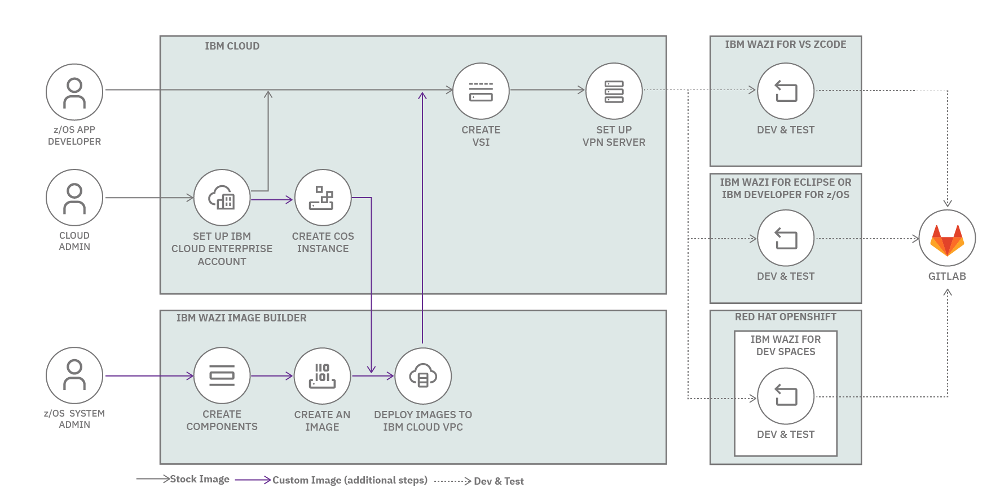

# Bring-your-own-image using Wazi Image Builder

**IBM® Wazi Image Builder** enables enterprises to extract your on-premise IBM Z® platforms and deploy it as a custom image through API or web-based graphical interface for use within the **IBM Cloud® Virtual Private Cloud (VPC)** infrastructure. Wazi Image Builder can be installed on an x86_64 Linux® system hosted either in a cloud or an on-premise physical or virtual machine.

## Features

Wazi Image Builder provides the following features:

- An application development and testing environment that can improve development infrastructure availability and flexibility.
- Current levels of IBM z/OS® software that give access to new runtime capabilities for development and testing for enterprises.
- Mixed workload support for enterprises, which can help reduce the development costs.
- An approachable and portable environment for education on Z for enterprises.
- A web-based interface to extract, manage, and deploy the images from existing Z packages.
- Creating and managing images from various sources.
- Deploying images for developers and testers in a self-service automated way.
- Monitoring the status and availability of all created assets and target environments.

## Flow using Image Builder

The following diagram show the content flow connecting up IBM Cloud with IBM Wazi Image Builder.

## Target environment

A [target environment](https://www.ibm.com/docs/en/wazi-aas/1.0.0?topic=builder-architecture-overview#intro_ee__title__4) is a IBM Cloud VPC environment, where you can deploy extracted z/OS artifacts as a custom image, which can then be used to enable a cloud native development and test experience for z/OS.

## Install Wazi Image Builder

See [Installing Wazi Image Builder](https://www.ibm.com/docs/en/wazi-aas/1.0.0?topic=builder-installing-wazi-image) to install:

- [Web server](https://www.ibm.com/docs/en/wazi-aas/1.0.0?topic=builder-architecture-overview#intro_ee__title__5). Use the browser to extract artifacts such as volumes, and transfer the artifacts to the storage server. Then, you can deploy the custom images to your target environment.
- [Signed certificate](https://www.ibm.com/docs/en/SSSTT9_1.0.0/com.ibm.zsys.rdt.tools.user.guide.doc/topics/installing_signed_certificate.html).
- [Storage server](https://www.ibm.com/docs/en/wazi-aas/1.0.0?topic=builder-architecture-overview#intro_ee__title__6) that stores extracted information on the intermediary storage machine, for example, SFTP server. Extracted information is never deleted from the storage server until the information is manually deleted.
- [ZD&T z/OS Extraction Utilities](https://www.ibm.com/docs/en/SSSTT9_1.0.0/com.ibm.zsys.rdt.tools.user.guide.doc/topics/rpm_install.html) isrequired if you want to create components from IBM Z platforms, either the physical or emulated IBM Z platforms. It needs to be installed on one or more IBM Z platforms to allow Wazi Image Builder to use the IBM Z platforms as source environments to extract z/OS resources.
- [Authentication](https://www.ibm.com/docs/en/SSSTT9_1.0.0/com.ibm.zsys.rdt.tools.user.guide.doc/topics/authentication_ee.html).
- [Network to on on-premises z/OS environment](https://www.ibm.com/docs/en/wazi-aas/1.0.0?topic=builder-setting-up-networking-premises-zos-environment).

## Source environments

Wazi Image Builder can work with your source environments to extract and deploy the necessary volumes to target environments. You can specify and configure source environments on the web server. For more information, see [Adding source environments](https://www.ibm.com/docs/en/SSSTT9_1.0.0/com.ibm.zsys.rdt.tools.user.guide.doc/topics/config_source.html).

## How to create z/OS image

See:

- [Creating z/OS images](https://www.ibm.com/docs/en/wazi-aas/1.0.0?topic=builder-creating-zos-images) for the steps to create the image and configure the image properties.
- [Deploying images to a Wazi as a Service target environment](https://www.ibm.com/docs/en/wazi-aas/1.0.0?topic=builder-deploying-images-wazi-as-service-target-environment) to deploy the image to a Wazi as a Service target environment in IBM Cloud® VPC.

## Next steps

See [Bringing your own image with Wazi Image Builder](https://www.ibm.com/docs/en/wazi-aas/1.0.0?topic=bringing-your-own-image-wazi-image-builder) product documentation for:

- Prerequisites and installation
- Setting up networking for on-premises z/OS environments
- Creating, monitoring, and managing components
- Creating, monitoring, and managing z/OS images
- Deploying images to Wazi target environment

See [Cloud Native IBM Z DevOps as a Service](https://mediacenter.ibm.com/playlist/details/1_5q5qeehb/) videos.

## Tutorial

[Getting started with IBM Wazi Image Builder](https://www.ibm.com/support/pages/getting-started-ibm-wazi-image-builder) shows an example of how to use IBM Wazi Image Builder to extract z/OS volumes and deploy them to the IBM Cloud and Wazi as a Service.

## References

- [Bringing your own image with Wazi Image Builder](https://www.ibm.com/docs/en/wazi-aas/1.0.0?topic=bringing-your-own-image-wazi-image-builder)