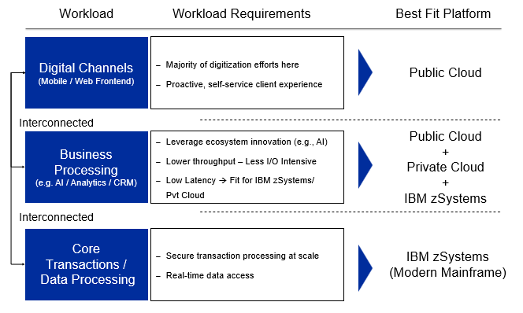

# Application modernization on Z mainframe

Organizations continue to rely on core applications and data on IBM Z. Transaction and batch programs contain business logic to maintain data integrity across business entities and to implement business policies, processes, and rules. An environment of optimized applications manages the overall lifecycle of this critical business data. Data that is generated or updated by one application is taken as input by a downstream application, which might in turn create or update more data.

!!! Key

    The need for transformation places significant demands on existing applications and data, which necessitates modernization and integration. No wonder CEOs ranked **Tech Modernization** as a top priority for their organizations in 2023. &dash; _[IBM IBV 2023 CEO study](https://www.ibm.com/thought-leadership/institute-business-value/c-suite-study/ceo)_

    67% of executives say the mainframe-based applications in their organizations need to be modernized. &dash; _IBM IBV 2023 Mainframe executive pulse survey_

    Modernize applications faster with less cost and risk by using hybrid cloud.
    
    A hybrid cloud transformation that integrates IBM Z can extend beyond two and a half times the value of a public cloud alone.

In this article, learn:

- Ways IBM recommends steps partners can take to drive your customers' application modernization. 
- The business reasons that can drive your customer modernization efforts.
- Scenerios that support your business and the steps you can take for scenarios you select.
- Training materials to get started in your application migration efforts.

## Modernization strategy

In a recent IBM Institute for Business Value study, 71% of executives say mainframe-based applications are central to their business strategy[^1]. Four out of five respondents say their organizations need to rapidly transform to keep up with competition, which includes modernizing mainframe-based apps and adopting a more open approach. The report confirms that executives view modernizing mainframe-based applications — and connecting them with new applications through a hybrid cloud environment — as crucial to driving a holistic digital transformation strategy across the mainframe and cloud.

## Business-aligned continuous approach

IBM recommends a business-aligned continuous approach to application modernization that allows businesses to build on existing investments, targeting only required application changes. Why rewrite 100% of your entire application portfolio if only 20% needs to be modernized? IBM’s approach starts by building on your current foundation.

Optimize [hardware and software costs](https://www.ibm.com/it-infrastructure/z/pricing-tailored-fit) while streamlining application performance and management. By integrating IBM Z into a [hybrid cloud platform](https://www.ibm.com/hybrid-cloud) to fully leverage [cloud-native](https://www.ibm.com/cloud/learn/cloud-native) development, you’ll unlock additional revenue by increasing access to mainframe data for analytics and [AI](https://www.ibm.com/cloud/learn/what-is-artificial-intelligence) through an API and data-modernization strategy.

As a result, you’re more empowered to increase business agility by moving from a [waterfall development](https://www.ibm.com/cloud/blog/agile-vs-waterfall) to an [enterprise DevOps](https://www.ibm.com/z/devops) process and an automated continuous [CI/CD pipeline](https://www.ibm.com/cloud/blog/ci-cd-pipeline) that is fully aligned to business priorities and is open and standard across the business, allowing for greater sharing of tools, skills and expertise.

And finally, reduce time-to-value with proven [application modernization patterns](https://www.ibm.com/cloud/architecture/architectures/application-modernization-mainframe/patterns), acceleration tools and best practices that include prescriptive “how-to” guides and showcases for modernizing and deploying on IBM z/OS and zLinux, IBM LinuxONE and public clouds together.

## Business drivers

Growth in value is driven by key areas of differentiation on IBM Z:

- Increased access to core business applications and data for broader enterprise use for AI, analytics, and new customer experience applications.
- More cost-effective options for application modernization compared to the application migration, emulation, and rewrite approach that some public cloud providers take. 

!!! key

    The IBM approach uses industry standard tools and includes an operating model shift that embraces enterprise-wide tooling to significantly improve ROI with less overall risk to business.

!!! important

    In a study by the IBM Institute of Business Value: 
    
    We found that most executives know where their modernization programs need to go and are charting a course to get there &dash; but only a few have really put the wheels in motion. Only 27% say their organization has modernized many of the necessary workflows, including the related applications, data, and systems.

    Leaders are focused on operational objectives and incremental improvements, rather than the strategic outcomes that will allow you to thrive in the business landscape of tomorrow.

## Action guide

The IBM Institute of Business value recommends the following steps:

1. **Adopt an iterative approach**. As part of your plan to integrate new and existing environments, factor in your industry and workload attributes. Partner with your business counterparts to co-create a business case and a “best-fit” roadmap designed to meet your strategic goals. Adopt an incremental and continuous approach to modernization instead of a big bang rip and replace. 
2. **Assess your portfolio and build your roadmap**. Examine the capabilities that define the role of the mainframe in your enterprise today and how those capabilities tie into the greater hybrid cloud technology ecosystem. In addition, prioritize cross-skilling within the organization and lean on your partners to make up for new or existing talent and resource gaps. 
3. **Leverage multiple application modernization entry points**. Enable easy access to existing mainframe applications and data by using APIs. Provide a common developer experience by integrating open-source tools and a streamlined process for agility. Develop cloud native applications on the mainframe and containerize applications.

## Hybrid approach

A hybrid best-fit approach that includes mainframes and cloud supports the integration and deployment of applications; which maximizes business agility and addresses client pain points.

- **Reduce the talent gap** with common tools and operating models across platforms
- **Accelerate time to market** with a consistent DevOps experience for cloud and mainframes, that includes repeatable patterns and reference architecture
- **Easily access mission-critical data** on the mainframe without moving off-platform
- **Optimize costs** with a tailored-fit-pricing  model on the mainframe

!!! quote

    "Part of our transformation was driven by the desire, and the need, to improve data-sharing across teams, so each line of business has 
the necessary information to deliver rapid support," says Jacqui Leggetter, Head of Integration (Deputy Director), DWP Digital, Department for Work and Pensions.

To learn more, download the report [Modernizing applications on hybrid cloud: Essentials to accelerate digital transformation](https://w3.ibm.com/services/lighthouse/documents/200719),

## Fit for purpose &dash; modernization

Enterprises want to deliver digital innovation without sacrificing performance, resilience, or security.

!!! quote

    _Fit for purpose_ alignment of workloads around IBM zSystems is what we call _modernization_.

Choosing the right platform based on workload requirements is critical first step to modernization. 

IBM zSystems delivers scalability and availability required for core business. Cloud brings innovation for digital channels and analytics for business insights.

The following illustration illustrates workloads and fit-for-purpose platforms.

IBM Z is fully enabled for the hybrid cloud as shown in the following illustration.

## Solution patterns

IBM Cloud extends mainframe application modernization options with several patterns.

| Solution Pattern | Digital Transformation Solution | Consulting Potental |  |
| - | - | - | - |
| **Discovery** | Identify targets for transformation that provide significant business value | :fontawesome-regular-square-check: | [Discovery](./discovery.md) |
| **DevOps** | Improve business agility and provide a modern DevOps platform |  :fontawesome-regular-square-check: | [DevOps Pipeline for Mainframe](./devops.md) [DevOps for Mainframe tooling](./wazi.md) |
| **Sustainability** | Achieve greater sustainability with IBM LinuxOne and IBM Cloud | :fontawesome-regular-square-check: | [Sustainability for Z on IBM Cloud](./sustainability.md) |
| **API Integration** | Simplify access to mainframe application with API strategy | :fontawesome-regular-square-check: | [API for Z workloads](./api.md) |
| **Security** | Secure enterprise workloads in a hybrid multicloud platform | |  |
| **Financial Services Cloud** | Build hybrid cloud platform for mainframe centric regulated workloads | | [Financial Services Cloud](../financial-services.md) |
| **Data** | Unlock and monetize mainframe data through a hybrid cloud | :fontawesome-regular-square-check: | |
| **Observability/SRE** | Provide seamless automation and observability involving mainframe and cloud native applications in hybrid cloud | :fontawesome-regular-square-check: | |
| **AI** | Infuse AI into mainframe workloads | :fontawesome-regular-square-check: |  |
| **Colo** | Resolve application latency issues with mainframe centric hybrid cloud platforms | :fontawesome-regular-square-check: | [Co-location pattern](./linuxone.md#co-location-pattern) |
| **Containerization** | Develop and deploy containerized applications on mainframe | :fontawesome-regular-square-check: | [Containers](./containers.md) |
| **Refactor** | Refactor traditional mainframe workloads into microservices without rip and replace | :fontawesome-regular-square-check: | [Generative AI for refactoring Z apps](./watsonxcodeassist.md) |

## Why IBM Cloud

Here's a sample of differentiators for IBM Cloud for Z:

- [Enterprise DevOps](#enterprise-devops)
- [Secure enterprise workloads](#secure-enterprise-workloads)
- [Sustainable computing](#sustainable-computing)
- [Integration with cloud native applications](#integration-with-cloud-native-applications)
- [Refactoring applications using generative AI](#refactoring-applications-using-generative-ai)

### Enterprise DevOps

- IBM Cloud is the only vendor who provides z/OS virtual servers running on native hardware
- Deploy new z/OS dev-test virtual servers in six minutes
- 15x performant as compared to emulated solutions of other public clouds

For more information, see [DevOps for Z](./devops.md).

### Secure enterprise workloads

- Only hyperscaler with FIPS 140-2 Level 4 Certification
- Secure clouds like HPCS, UKO, SCC
- Secure operating environments (Hyper Protect Virtual Servers) providing data security at rest, in transit, and in memory through proven IBM zSystems technologies

For more information, see [Security for Z](./security.md).

### Sustainable computing

- IBM LinuxONE consume half the energy compared to x86 for the same workload
- Average of 10:1 consolidation of cores for the same workloads

For more information, see [Sustainability for Z](./sustainability.md).

### Integration with cloud native applications

- Direct integration and support for IBM Cloud Paks and Red Hat OpenShift running on IBM LinuxONE offerings and in co-location models
- Native IBM zSystems security can be expanded across the enterprise
- Wealth of experience and patterns with IBM partners

For more information, see [LinuxONE](./linuxone.md).

### Refactoring applications using generative AI

- **Understand**. Visualize and auto-document your COBOL application at the enterprise level.
- **Refactor**. Discover programs and data needed for a refactored business service within a large application.
- **Transform**. AI assistant to generate Java code in minutes, not months.
- **Validate**. Streamlined and accelerate testing of new code.

For more information, see [IBM Application Discovery and Delivery Intelligence (ADDI)](./addi.md) and [Generative AI for refactoring Z apps](./watsonxcodeassist.md).

## Next steps

Learn more about mainframe modernization.

### Mainframe modernization basics

[Application Modernization on IBM Z Sales Badge](https://yourlearning.ibm.com/activity/PLAN-5F912B2BB02B). Learn how mainframe Application Modernization with IBM Z and Cloud together can bring more value to clients. Learn best practices to help clients accelerate their application modernization journey.

The curriculum looks at some of the key drivers and challenges associated with mainframe application modernization. What industry analysts are recommending, what clients are doing today, and a walk-through of IBM’s prescriptive approach to continuously modernize applications with hybrid cloud leveraging IBM technology and expertise.

### Learn mainframe development

[IBM Z Xplore](https://ibmzxplore.influitive.com/) provides a learning experience to upskill, reskill, and learn new skills as you begin a journey with IBM zSystems and enterprise computing. The experience is open to all, available at no charge and includes:

- IBM zSystem access
- Progressive learning paths
- Hands-on challenges
- Digital badging
- Rewards
- Leaderboard

See [Mainframe enablement roadmap](./getstarted.md).

### Video series on mainframe DevOps

See IBM Media Center videos: [Cloud Native IBM Z DevOps as a Service](https://mediacenter.ibm.com/playlist/details/1_5q5qeehb/)

## References

- Product page [Mainframe application modernization on IBM Cloud](https://www.ibm.com/cloud/mainframe-app-modernization)
- Blog [Mainframe Application Modernization with IBM Cloud and IBM zSystems](https://www.ibm.com/blog/mainframe-application-modernization-with-ibm-cloud-and-ibm-zsystems/)
- [IBM Wazi as a Service documentation overview](https://www.ibm.com/docs/en/wazi-aas/1.0.0)
- [Application modernization for IBM Z architecture](https://www.ibm.com/cloud/architecture/architectures/application-modernization-mainframe/overview)
- [IBM Z and Cloud Modernization Center](https://www.ibm.com/community/z-and-cloud/)
- [Improve business agility and provide modern DevOps platform for mainframe applications with IBM Cloud](https://www.ibm.com/downloads/cas/Y3JDDJOD)
- [watsonx Code Assistant](https://www.ibm.com/products/watsonx-code-assistant)
- [Lower Costs and Increase ROI with Application Modernization on a Hybrid Cloud](https://www.ibm.com/blog/lower-costs-and-increase-roi-with-application-modernization-on-a-hybrid-cloud/)
- [Modernizing applications on hybrid cloud](https://www.ibm.com/thought-leadership/institute-business-value/en-us/report/application-modernization-hybrid-cloud)

### For IBM Partners

- [Accelerate application modernization with IBM Z and Cloud](https://ibm.seismic.com/Link/Content/DCR4jCd9G2J348M2HV38mccjFpBB)

[^1]:
    IBM Business Value Report [Application modernization on the mainframe](https://www.ibm.com/thought-leadership/institute-business-value/report/application-modernization-mainframe)