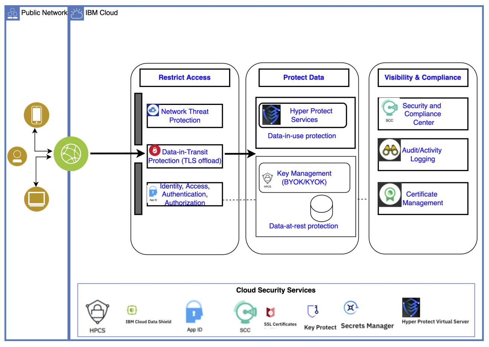

# Security for hybrid cloud/mainframe applications

Application and data running on the IBM zSystems platform are often mission-critical to the business, and they require the highest levels of security available. As public cloud applications increasingly need to access mainframe applications and data, the expectation is for the same level of enterprise-grade security across a hybrid multicloud platform.

IBM Cloud is designed for enterprise and regulated workloads and has developed many security services based on IBM Z platform security features to support both IBM Cloud’s own platform architecture and offered as cloud services to clients. 

!!! Info "Challenges"

    Client face several challenges:

    - Data security in the public cloud
    - Hybrid multi-cloud security
    - Protection from cloud admins and other privileged users
    - Absolute control of data even from authorities/agencies

This article describes how you can integrate your mainframe applications in the cloud and provide security of your data and its access.

!!! Key Keys

    Mainframe app modernization in IBM Cloud

    - Built-in confidential computing and zero trust feature support
    - Identification of security vulnerabilities
    - Unique service, Unified Key Orchestrator (UKO), to handle keys in a secure way across clouds and on-prem with the highest possible security

## Security architecture pillars

IBM Cloud platform offers multiple security services across IaaS, PaaS, and SaaS layers to implement these three pillars:

- **Platform security control**. Identity and application security services will allow authenticated users and services access to only authorized resources.
- **Data protection**. Protect the data while it

    - Traverses on hybrid cloud network (_data-in-transit_)
    - Is being processed in the compute subsystem (_data-in-use_)  
    - Is stored across multiple places (_data-at-rest_) 

- **Compliance visibility and control** using:

    - Key Management Services (KMS) such as **Key Protect (KP)** and **Hyper Protect Crypto Services (HPCS)**
    - Confidential computing features such as **Hyper Protect** Family of services including [IBM Cloud Hyper Protect Virtual Servers (HPVS)](https://www.ibm.com/products/hyper-protect-virtual-servers/cloud)
    - Secure, comply and manage cloud and containerized application ecosystems with a comprehensive **Cloud-Native Application Protection Platform (CNAPP)** solution suite, [IBM Cloud Security and Compliance Center](https://www.ibm.com/products/security-and-compliance-center)
    - Unique security posture management services to enable easier logging, monitoring, auditing, and regulatory compliance management

## Security architecture

The following diagram shows how network traffic to the enterprise workloads in IBM Cloud is controlled through network threat protection services to block external attacker, segment internal networks, and provide context-based network segregation.

In addition, identity and application security services will allow authenticated users and services access to only authorized resources.

## Compliance visibility and control

IBM Cloud provides two types of Key Management Services (KMS) to protect enterprise workload’s 
data through encryption. 

### Key Protect

Key Protect (KP) which provides ‘Bring-Your-Own-Key (BYOK)’ offering based on a multi-tenant crypto card hardware (Hardware Security Module (HSM)). This provides the operational assurance to enterprise encryption needs in line with most of the other hyperscalers like Azure and AWS. This is FIPS 140-2 Level 3 certified. See [Key Protect](../security/keyprotect.md)

### Cloud Hyper Protect Crypto Services

[IBM Cloud Hyper Protect Crypto Services](https://www.ibm.com/cloud/hyper-protect-crypto) manages client in IBM Cloud, and it is [FIPS 140-2 Level 4 certified](https://nvlpubs.nist.gov/nistpubs/FIPS/NIST.FIPS.140-2.pdf), which is the industry’s highest certification for a Hardware Security Module (HSM). With the functionality of _Keep Your Own Key (KYOK)_, keys are solely owned and managed by the clients.

!!! Key "Technical assurance"

    **Hyper Protect Crypto Services** provides _technical assurance_ to enterprise encryption needs which is based on confidential computing and FIPS 140-2 Level 4 certified HSMs. 
    
    The ‘technical assurance’ is ensured as even IBM Cloud administrators cannot access the encryption keys,
    
    The feature is unique to IBM Cloud.

The following diagram shows high-level reference architecture of a modern mainframe application being secured both at the development and production phases using HPCS centric KYOK feature.

The diagram illustrates:

- Custom image built using **Wazi builder** to provision a z/OS VSI for dev/test within IBM Cloud 
VPC is protected by Hyper Protect Crypto Service using KYOK
- As the mainframe application brought from an on-premises LPAR which are used to develop 
and test mainframe applications within IBM Cloud are encrypted using an encryption key 
owned and managed exclusively by the enterprise owner which assures full data security
- HPCS service can also be used to provide the additional protection through **TLS server certification offload** mechanism to help protect the mainframe application on the wire
- The protection of mainframe application residing in databases and storage is done using 
**HPCS integrations** to these services
- The applications and data during compute runtime are also protected through Hyper Protect 
services within IBM Cloud VPC, VPC may also include **VMWare** for IBM Cloud workloads,
Container workloads and other virtual machine-based workloads
- The compliance checks and validation of the solution can be done using IBM Cloud based 
service called **Security and Compliance Center (SCC)**, both during development within IBM 
Cloud VPC and during pre-prod testing of these enterprise applications in on-premises IBM 
zSystem LPARs

For more information, see [Hyper Protect Crypto Services](../security/hyperprotect.md).

### Unified Key Orchestrator

IBM Cloud’s security services can also be extended to hybrid-cloud-centric enterprise workloads through the [Unified Key Orchestrator](https://www.ibm.com/cloud/blog/announcements/unified-key-orchestrator).

The following illustration shows the key management enterprise applications deployed across this hybrid multicloud platform can be provided by HPCS/UKO service with single pane of glass. 

For more information, see [Unified Key](../security/unifiedkey.md).

### Cloud Security and Compliance Center

Address hybrid cloud, multicloud and containerized application security from code to cloud with a comprehensive _Cloud-Native Application Protection Platform (CNAPP)_ solution suite. Centrally manage your organization’s security, risk and compliance to regulatory standards, enable security and DevOps teams, secure sensitive data and protect workloads with real-time threat detection and vulnerability management. 

For more information, see [IBM Cloud Security and Compliance Center](https://www.ibm.com/products/security-and-compliance-center) product page.

To get started, sign in to your IBM Cloud account to [Manage the security and compliance of your workloads](https://cloud.ibm.com/security-compliance/overview).

## Next steps

See:

- [Second generation of IBM Hyper Protect Platform](https://www.ibm.com/downloads/cas/GPVMWPM3)
- [Hyper Protect tutorials](../security/hyperprotect-tutorials.md)
- [Key Protect tutorials](../security/keyprotect-tutorials.md)
- [IBM Cloud Framework for Financial Services - Control Requirements](https://cloud.ibm.com/docs/framework-financial-services-controls?topic=framework-financial-services-controls-overview)

## Reference

- [Secure mainframe applications and data in a hybrid multicloud platform](https://www.ibm.com/downloads/cas/XNNPE9OV)
- [Mainframe Application Modernization with IBM Cloud and IBM zSystems](https://www.ibm.com/blog/mainframe-application-modernization-with-ibm-cloud-and-ibm-zsystems/)