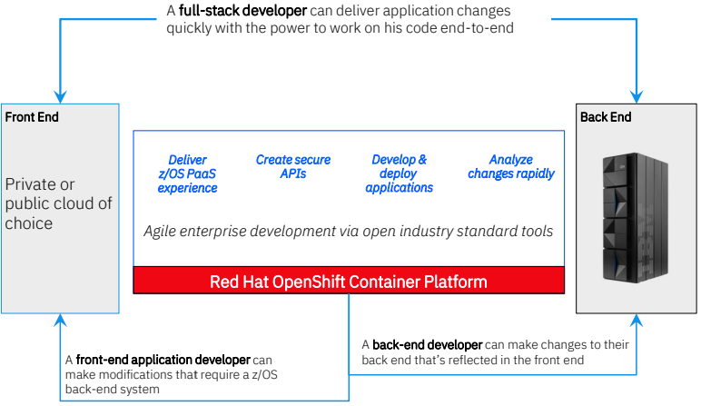
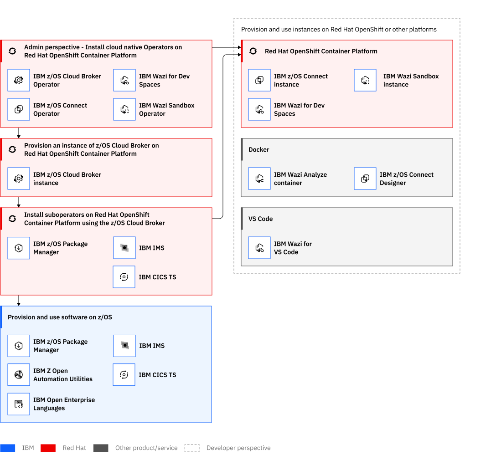

# IBM Z and Cloud Modernization Stack

**IBM Z® and Cloud Modernization Stack** is built to balance robust reliability with the need for new innovation. By combining the power of IBM Z and the strength of Red Hat® OpenShift® Container Platform, IBM Z and Cloud Modernization Stack delivers a modern, managed as-a-service model to complement your most resilient production workloads.

## Benefits

- **Reduce the talent gap**. IBM zSystems supports open and standard programming languages, toolchains, and development practices, opening up a broad pool of available talent.
- **Create a consistent DevOps experience**. IBM zSystems supports modern DevOps tools and practices that are common and consistent with cloud application development techniques.
- **Access mainframe data easily**. Use your IBM zSystems data without moving off-platform to unlock the full value of your mission-critical data.
- **Optimize costs**. Select from a broad set of capabilities, languages, and tools, paying only for what you use.
- **Maintain optionality**. Use Red Hat® OpenShift® as a common open hybrid cloud platform to build once and deploy where there is the best fit.

## Features

- **Application analysis**. Reduce the risk of application changes by rapidly analyzing your code changes to ensure your dependencies are known before getting started.
- **Open-standard-based APIs**. Provide highly-secure access to mainframe applications and data through industry standard APIs using Open API specifications.
- **Cloud-native development**. Develop and modernize IBM® z/OS® applications with a cloud-native approach, increasing speed and agility for greater developer productivity.
- **The z/OS PaaS experience**. Use simple and automated z/OS software management for self-serve access to z/OS environments for developers.

The following illustration shows The IBM Z and Cloud Modernization Stack delivers a full-stack developer experience.

## Use cases

- **Enable low-code Open APIs in minutes**. Implement and test new APIs in isolation using an OpenAPI 3 specification and API first mapping.
- **Edit, debug, build and Deploy z/OS applications using cloud native tools**. Use industry-standard tools common across platforms for application development.
- **Employ rapid application analysis**. Plan your code changes and generate an impact analysis graph to view the dependencies.
- **Enhance apps with Open Enterprise languages**. Add new microservices or application enhancements using the open enterprise language of your own choosing.
- **Self-service management of your z/OS environment**. Experience z/OS platform as a service (PaaS) by extending Red Hat OpenShift with preconfigured software packaging.
- **Use on-demand z/OS environments and resources**. Increase developer and systems programmer productivity with on-demand provisioning of z/OS resources using industry standard skills and practices.

## Stack products and capabilities

IBM Z and Cloud Modernization Stack comes with the following products and capabilities. 

Each product in IBM Z and Cloud Modernization Stack provides an operator to Red Hat® OpenShift® Container Platform so that it can be controlled from there. An operator extends the Kubernetes API by providing a set of application-specific resources that package, deploy, and manage that application. It is essentially a custom controller.

IBM Z and Cloud Modernization Stack delivers two types of operators:

- **Red Hat® OpenShift® Container Platform operators**. These operators are installed and run directly on Red Hat® OpenShift® Container Platform. They do not need another operator to install them. Some, but not all, of these operators are certified. These "native" operators are z/OS Cloud Broker, z/OS Connect, Wazi Sandbox, and Wazi for Dev Spaces.
- **Suboperators**. These operators can be installed only through the z/OS Cloud Broker Operator. These suboperators are z/OS Package Manager, IBM IMS operator, and IBM CICS TS operator.

The following diagram shows the architecture of the stack.

### Red Hat OpenShift Container Platform Operators

- [Wazi Analyze](https://www.ibm.com/docs/en/SSV97FN_2022.1.1/wazidoc/wazi/ibm-wazi-for-red-hat-codeready-workspaces.html). Analyzes applications so that developers can quickly discover the relationships between the components of z/OS applications. For more explanation in this wiki, see [Wazi Analyze](./analyze.md).
- [Wazi Code](https://www.ibm.com/docs/en/SSV97FN_2022.1.1/wazidoc/wazi/ibm-wazi-for-red-hat-codeready-workspaces.html)	Provides a familiar experience for developers when they work with z/OS applications. Developers can edit, build, and debug applications through z/OS language support. For more explanation in this wiki, see [Wazi Code](./wazicode.md).
- [Wazi Sandbox](https://www.ibm.com/docs/en/SSV97FN_2022.1.1/wazidoc/wazi/ibm-wazi-for-red-hat-codeready-workspaces.html) Provides a containerized, self-service personal sandbox environment on Red Hat® OpenShift® that runs on x86 hardware. For more explanation in this wiki, see [Wazi Sandbox](./sandbox.md)
- [z/OS Connect](https://www.ibm.com/docs/en/SSV97FN_2022.1.1/zosconnect/welcome/Overview.html)	Provide simple and intuitive containerized z/OS APIs on Red Hat® OpenShift®.
- [z/OS Cloud Broker](https://www.ibm.com/docs/en/SSV97FN_2022.1.1/zoscb/zoscb-overview.html)	Integrates z/OS-based services and resources with Red Hat® OpenShift®.

### z/OS Cloud Broker-managed suboperators

- [z/OS Package Manager](https://www.ibm.com/docs/en/SSV97FN_2022.1.1/zpm/overview.html). Deploys and manages software on z/OS systems from Red Hat® OpenShift® Container Platform.
- [IBM IMS Operator Collection](https://www.ibm.com/docs/en/SSV97FN_2022.1.1/ims-operator/imsoc-overview.html). Provides self-service provisioning of IBM Information Management System (IMS).
- [IBM CICS TS Operator Collection](https://www.ibm.com/docs/en/SSV97FN_2022.1.1/cicsts/overview.html). Provides self-service provisioning of IBM CICS Transaction Server (CICS TS).

#### z/OS Package Manager packages

- [C/C++ for Open Enterprise Languages on z/OS](https://www.ibm.com/docs/en/SSV97FN_2022.1.1/cpp_compiler/overview.html). Allows the installation and build of native components of applications that are written with the Open Enterprise SDKs.	
- [64-bit SDK for z/OS®, Java™ Technology Edition](https://www.ibm.com/docs/en/SSV97FN_2022.1.1/java/com.ibm.java.80.doc/introduction.html). Provides development tools and a Java™ application runtime environment.1	
- [Open Enterprise SDK for Go](https://www.ibm.com/docs/en/SSV97FN_2022.1.1/golang/overview_golang.html). Provides a Go compiler for z/OS.
- [Open Enterprise SDK for Node.js](https://www.ibm.com/docs/en/SSV97FN_2022.1.1/nodejs/overview.html). Provides an extended implementation of the Node.js runtime for z/OS.	
- [Open Enterprise SDK for Python](https://www.ibm.com/docs/en/SSV97FN_2022.1.1/python/overview_python.html). Provides a Python interpreter for z/OS.
- [Z Open Automation Utilities](https://www.ibm.com/docs/en/SSV97FN_2022.1.1/zoau/zoautil_purpose.html). Helps developers who are familiar with Linux® and UNIX to use the UNIX System Services environment to access z/OS resources, such as data sets, without the need for JCL.

## Getting started

The lists in this section provide steps to get started with a product in IBM Z and Cloud Modernization Stack.

- [Getting started with Wazi Analyze](https://www.ibm.com/docs/en/SSV97FN_2022.1.1/wazidoc/com.ibm.wazi.analyze.doc/topics/get_started.html)
- [Getting started with Wazi Sandbox](https://www.ibm.com/docs/en/SSV97FN_2022.1.1/wazidoc/sandbox/getting_started_sandbox.html)
- [Getting started with z/OS Cloud Broker and z/OS Package Manager](https://www.ibm.com/docs/en/SSV97FN_2022.1.1/zstack/getting_started_cloudbroker_zpm.html)
- [Getting started with IMS Operator Collection](https://www.ibm.com/docs/en/SSV97FN_2022.1.1/ims-operator/imsoc-get-started-rm.html)
- [Getting started with IBM CICS TS Operator](https://www.ibm.com/docs/en/SSV97FN_2022.1.1/cicsts/getstart-cicstsoperator.html?pos=2)
- [Getting started with C/C++ for Open Enterprise Languages on z/OS](https://www.ibm.com/docs/en/SSV97FN_2022.1.1/cpp_compiler/getstart.html)
- [Getting started with Open Enterprise SDK for Go](https://www.ibm.com/docs/en/SSV97FN_2022.1.1/golang/zstack_get_start.html)
- [Getting started with Z Open Automation Utilities](https://www.ibm.com/docs/en/SSV97FN_2022.1.1/zoau/zstack_getting_started_zoau.html)

### Checklist

The lists in this section provide checklists to get started with a product in IBM Z and Cloud Modernization Stack.

- [Checklist Wazi Code](https://www.ibm.com/docs/en/SSV97FN_2022.1.1/wazidoc/com.ibm.wazi.developer.doc/wazi_code_checklist.html)
- [Checklist z/OS Connect](https://www.ibm.com/docs/en/SSV97FN_2022.1.1/zosconnect/planning/getting_started_checklist.html)
- [Install Open Enterprise SDK for Node.js](https://www.ibm.com/docs/en/SSV97FN_2022.1.1/nodejs/stack_install_overview.html)
- [Checklist Open Enterprise SDK for Python](https://www.ibm.com/docs/en/SSV97FN_2022.1.1/python/get_start_check_list.html)

## Set up workflow

First install on Red Hat® OpenShift® Container Platform the operators that have no dependency on another, then use z/OS Cloud Broker to install the suboperators for z/OS and provision instances of products for use on Red Hat® OpenShift® or other platforms.

The following diagram shows the steps to install IBM Z and Cloud Modernization Stack.

1. [Install certified operators on Red Hat® OpenShift® Container Platform](https://www.ibm.com/docs/en/cloud-paks/z-modernization-stack/2023.4?topic=overview-workflow#install-certified-operators-on-red-hat-openshift-container-platform)
2. [Install suboperators through z/OS Cloud Broker](https://www.ibm.com/docs/en/cloud-paks/z-modernization-stack/2023.4?topic=overview-workflow#install-suboperators-through-zos-cloud-broker)
3. [Provision and use instances on Red Hat OpenShift or other platforms](https://www.ibm.com/docs/en/cloud-paks/z-modernization-stack/2023.4?topic=overview-workflow#provision-and-use-instances-on-red-hat-openshift-or-other-platforms)

See [Installing products](https://www.ibm.com/docs/en/SSV97FN_2022.1.1/zstack/installing.html) for details of the required installation sequence and links to detailed instructions.

- [Where to get the products](https://www.ibm.com/docs/en/SSV97FN_2022.1.1/zstack/source-images.html)
- [Preparing to install online](https://www.ibm.com/docs/en/SSV97FN_2022.1.1/zstack/preparing-install.html)
- [Installing the products](https://www.ibm.com/docs/en/SSV97FN_2022.1.1/zstack/installing.html)
- [Setting environment variables on z/OS](https://www.ibm.com/docs/en/SSV97FN_2022.1.1/zstack/environment-variables.html)
- [Uninstalling](https://www.ibm.com/docs/en/SSV97FN_2022.1.1/zstack/uninstalling.html)

## References

- Product page [IBM Z and Cloud Modernization Stack](https://www.ibm.com/products/z-and-cloud-modernization-stack)
- [IBM Z and Cloud Modernization Stack](https://www.ibm.com/docs/en/cloud-paks/z-modernization-stack/2023.4?topic=overview) overview
- [What's in IBM Z and Cloud Modernization Stack?](https://www.ibm.com/docs/en/cloud-paks/z-modernization-stack/2023.4?topic=overview-whats-in-z-cloud-modernization-stack)
- IBM Z and Cloud Modernization Stack [How it works](https://www.ibm.com/docs/en/cloud-paks/z-modernization-stack/2023.4?topic=overview-how-it-works#understanding-the-components)