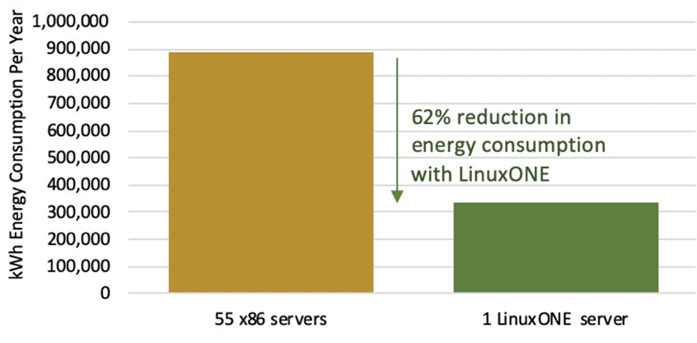
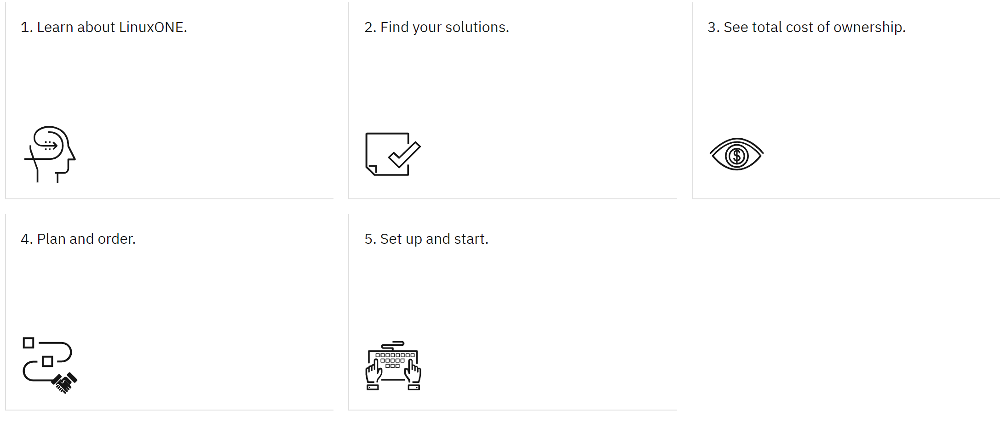

# Sustainability on IBM Cloud

Sustainability is one of the key areas of focus for many industries embarking on digital transformation. Sustainable computing focuses on how to make computing more efficient with an end goal of reducing the impact on the environment.

The IBM LinuxONE platform is helping clients address their needs for sustainable computing. IBM Cloud is joining this effort making IBM LinuxONE virtual servers available in its data centers.

## Client challenges

- Sustainability in computing is high priority focus area for CEOs
- Fit-for-purpose platform selection for app modernization is needed
- Business agility with quick provisioning of enterprise platforms
- Secure, scalable databases with bursting capacity

## LinuxONE

IBM LinuxONE is an enterprise-grade Linux® server that brings together IBM’s experience in building Z mainframe systems with the openness of the Linux operating system.

With a unique architecture designed to meet the needs of mission-critical workloads, LinuxONE provides a sustainable, secure and scalable system for companies of all sizes.

!!! key "Keys"

    - IBM LinuxONE delivers a 59% savings in power consumption as compared to x86 running workloads with the same throughput.
    - Average of 10:1 consolidation of cores for the same workload.

The following diagram shows a concrete example of a large Asia Pacific Insurance company focused on decreasing data center costs and carbon emissions. 

An analysis that discovered that workloads running on 55 x86 servers could be consolidated onto one IBM LinuxONE system, saving 86% in floor space and 62% in annual energy consumption.

## Value proposition of IBM Cloud

IBM Cloud is the only hyperscaler offering LinuxONE in virtual server and in bare metals.

As IBM cloud offers LinuxONE platform in the public cloud, we are offering customers options to remove their footprint from their data centers and adopt sustainability of IBM Cloud. Also, we are offering LinuxONE platform options in IBM Cloud, we are offering industry-lead sustainable platform deployment options via IBM Cloud.

IBM Cloud LinuxONE virtual servers for VPC gives fast-provisioning compute capacity with the highest network speeds and most secure, software-defined networking resources available on the IBM Cloud. 

This offering is built on IBM Cloud Virtual Private Cloud (VPC) and IBM LinuxONE processors.

## Sustainability action plan

!!! tip "Action plan"

    - Consolidate of databases of both SQL (PostreSQL, DB2) and NoSQL (MongoDB) to improve total cost of ownership, benefit from qualities of service the platform provides. See [Databases and data analytics on Red Hat OpenShift](https://www.redhat.com/en/technologies/cloud-computing/openshift/databases-and-data-analytics#why-deploy-databases-on-kubernetes).
    - Containerize workloads running on Red Hat OpenShift provide economies of scale by maximizing compute resources. For more information see, [Container workloads on Z](./containers.md) and [DevOps for Z](./devops.md).

## Get started

[Try the TCO and CO2e Calculator](https://www.ibm.com/resources/systems/zsystems-linuxone-tco-co2e-calculator/)

See [Journey to LinuxONE](https://www.ibm.com/support/z-content-solutions/journey-to-linuxone/)

## Reference

- [IBM LinuxONE](https://www.ibm.com/linuxone)
- [IBM LinuxONE documentation](https://www.ibm.com/docs/en/systems-hardware/linuxone)
- [Achieve greater sustainability with IBM LinuxONE and IBM Cloud](https://www.ibm.com/downloads/cas/K8KYXRQG)
- [What are containers?](https://www.ibm.com/topics/containers)
- [Sustainability on IBM LinuxONE 4](https://www.ibm.com/products/linuxone-4/sustainability)