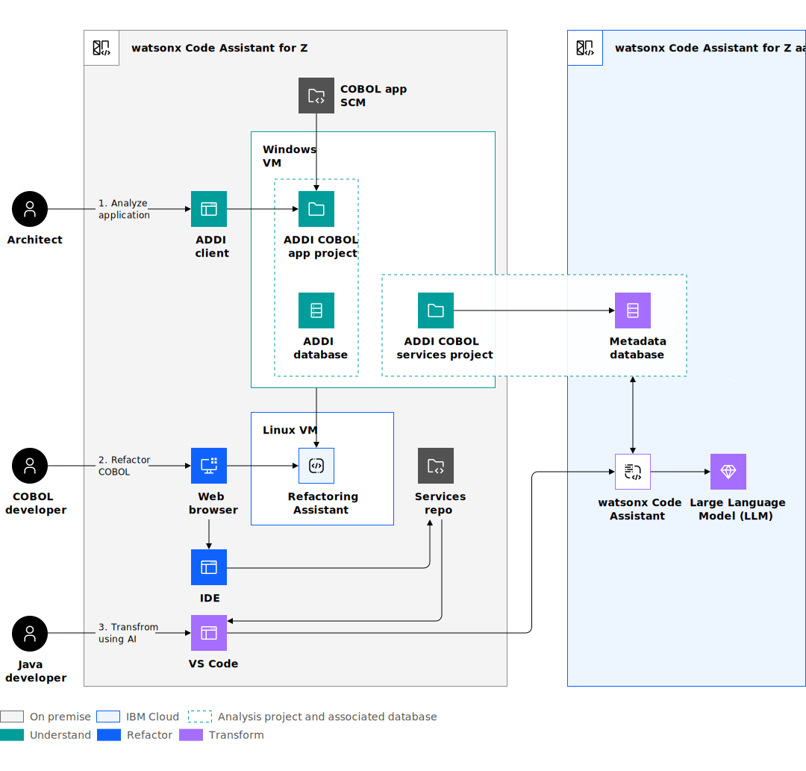
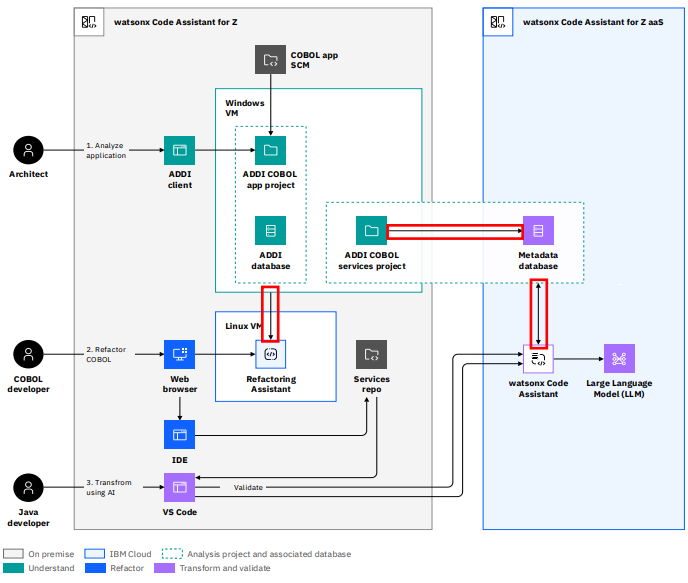

# watsonx Code Assistant Architecture

Watsonx Code Assistant for Z comprises components that run on-premises and in IBM Cloud.

First, to understand COBOL applications, an architect uses the functions of Application Discovery and Delivery Intelligence (ADDI). This tool enables an Architect to perform different tasks, including visualizing the relationships between different programs, run reports, and search code. 

The COBOL developer can use Refactoring Assistant to start extracting the COBOL business service that the Architect identified from a monolith application. 

If the modernization strategy involves converting the COBOL service to Java, the COBOL developer can commit the service into a source code management repository (SCM) such as Git. 

The Java developer uses Z Open Editor in **Visual Studio Code (VS Code)** to connect to the watsonx Code Assistant for Z service in IBM Cloud. 

The following diagram shows the architecture for the solution.

## On premise

The on premise products that are included in watsonx Code Assistant for Z are:

- **Applicaton Discovery and Delivery Intelligence (ADDI)** runs in a Windows VM. 
- **IBM watsonx Code Assistant for Z Refactoring Assistant** runs as a container in a Linux VM.

ADDI can work with traditonal SCMs like Endevor, but to transform a COBOL service to Java, you will also need to integrate with an SCM such as Git. Git is preferred as it is used in the supplied automation scripts. 

To briefly explain each component:

- Use ADDI Eclipse client to visualize and understand their COBOL application. The COBOL application analysis is available through a project that is built in the back-end server on a Windows VM. The metadata for the analysis is stored in an ADDI database on the Windows VM – this database could be SQL server or Db2. 
- The Refactoring Assistant is a container that runs in a Linux VM and is accessed through a Web browser. The Refactoring Assistant connects securely to the ADDI database to access the metadata to help the COBOL developer visualize the code and slice relevant code from a business function into a new COBOL program. The COBOL developer can then export the COBOL to continue refactoring and working with the COBOL in an IDE of their choice. This could be IDz or VS Code with the Z Open Editor 
extension installed. If the COBOL service is going to be transformed to Java, it needs to be commijed into an SCM repo where it can be scanned and its metadata stored in a different ADDI project. This ADDI project is connected to a Cloud database that is associated with watsonx Code Assistant for Z aaS in IBM Cloud. 

The Java developer uses the Z Open editor and Java extensions in VS Code to take the COBOL service from the SCM repo and use the capabilities in Z Open Editor to transform the COBOL to Java. This is a two-step process, where the Java developer generates Java classes first. These classes contain empty methods. The Java developer can then generate Java code for each method in turn.

## IBM Cloud

The IBM cloud services are:

- **IBM Db2 database**, which is is required by watsonx Code Assistant for Z cloud service to store metadata about the transform from COBOL to Java. Note that no code is stored in IBM Cloud. 
- **IBM watsonx Code Assistant** – pick the Z plan in the catalog.

## Data Flow description

The following diagram shows three key data flows between components of the watsonx Code Assistant for Z architecture.

The data and metadata flow from the ADDI database to the Refactoring Assistant component. In order for Refactoring Assistant to function it must be able to connect and pull data from ADDI. This connection is a JDBC connection from the RA container to the ADDI database. 

There is also a data flow when the ADDI services project is built/parsed to write its metadata to the DB2 instance of wca4Z on the cloud.

Lastly, there is data flowing from that DB2 database to the watson Code Assistant code in the cloud.

## Next steps

IBM Learning course: [IBM watsonx Code Assistant for Z Technical Deep Dive](https://yourlearning.ibm.com/activity/PLAN-7AEEB533C014).

## References

- Product documentation [IBM watsonx Code Assistant for Z](https://www.ibm.com/docs/en/watsonx-code-assistant-4z/1.0)

### For IBM Partners

- [watsonx Code Assistant for Z Architecture Walkthrough](https://ibm.seismic.com/Link/Content/DCHR3WRXJCGH4GmQ7DTP3TgDQM88)