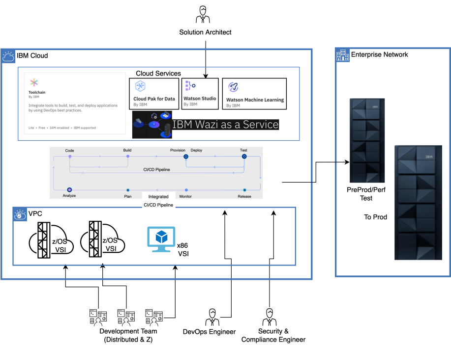
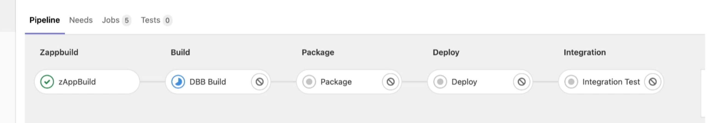

# DevOps on Wazi as a Service

One of the key aspects of digital transformation is the ability to deliver new business functions and changes to the existing functions at cloud scale. To support this, enterprises are adopting secure DevOps and GitOps practices embracing open source tools and standard processes to help development, test and operations teams work together while modernizing the workloads.

IBM Cloud is designed for enterprise workloads and offers the IBM zSystems virtual server compute (both z/OS and LinuxONE) available in IBM Cloud VPC in the catalog. IBM Cloud can be combined with x86 development environments, dev test, and deployment to on premises mainframe for production using common DevOps practices.

The DevOps practices can be designed to be similar to the cloud DevOps practices practiced for other on premises and cloud deployments.

With Integrated CI/CD pipelines spanning x86 and z/OS compute infrastructure available in IBM Cloud, developers can build innovative solutions and test them on respective infrastructure and deliver changes faster with confidence.

!!! Key "Use cases"

    - Cloud centric access of z/OS compute for development
    - Remove obstacles in testing of z/OS applications through Cloud
    - Easy access of z/OS compute for education and innovation
    - Cloud centric integrated enterprise DevOps for mainframe and cloud native workloads

## High-level architecture

One of the services to streamline and modernize mainframe application development and testing is **IBM Wazi as Service** offered as an IBM Cloud VPC Virtual Server. Through this service, enterprises can use an integrated toolchain and a development and test environment on IBM Cloud and create a modern integrated enterprise DevOps pipeline across mainframe and distributed applications.

The following diagram shows a best practice for an architecture incorporating development, test, operations, security teams along with solution architects to develop innovative mainframe applications on IBM Cloud.

The following diagram shows the CI/CD pipeline in action as it deploys an application to mainframe.

## Step-by-step

The following step-by-step instructions show how to create an integrated DevSecOps pipeline for mainframe applications and create z/OS VSI in IBM Cloud for both traditional and cloud native container applications. 

1. **Create a Toolchain** demo gives detailed steps to create a secure pipeline for z/OS application development in IBM Cloud.
2. IBM Cloud offers a z/OS VSI in IBM Cloud VPC to help enterprises get access to IBM z/OS compute for development and test using IBM Wazi as Service. As a first step towards creating z/OS VSI, **manage IBM Cloud account** demo gives detailed steps in preparing the mainframe development teams to work with IBM Cloud account.
3. **Create a z/OS Virtual Server Instance (VSI)** demo demonstrates how to create a z/OS VSI in IBM Public cloud VPC for mainframe application development and test purposes.
4. **Connect to the z/OS VSI** demo demonstrates how to connect to the z/OS VSI created earlier and prepare it for development and test tasks that are done similar to an on-premises IBM Z system.
5. **Running COBOL DBB Build sessions** demo explains how to run COBOL DBB build sessions on the z/OS VSI using IBM Wazi and VS code and it also explains running various automation scripts.
6. As we have successfully created z/OS VSI and ran few build sessions, this demo explains how to **debug the VSI** for any issues if any, in development and test.
7. To bring development tools for mainframe application modernization projects using z/OS VSI created in IBM Cloud VPC, the demo **Wazi developer for workspaces** gives detailed steps of how it can be deployed and used from an OpenShift cluster in IBM Cloud.

## Next step

See:

- [Improve business agility and provide modern DevOps platform for mainframe applications with IBM Cloud](https://www.ibm.com/downloads/cas/Y3JDDJOD)
- [DevOps from APIs to IBM Z for Dummies](http://www.recarta.co.uk/wp-content/uploads/2017/05/DevOpsforDummies-ilovepdf-compressed.pdf)
- [Enterprise DevOps pattern](https://www.ibm.com/cloud/architecture/architectures/z-enterprise-devops-pattern)
- Whitepaper: [Develop mainframe software with OpenSource source code managers and IBM dependency based build](https://www.ibm.com/support/pages/system/files/inline-files/Develop-Mainframe-Software-with-Git-and-IBM_Dependency_Based_Build.pdf)

## References

- [Building enterprise CI/CD pipelines for mainframe applications using the IBM Z & Cloud Modernization Stack](https://www.ibm.com/support/pages/node/6960229)
- [Improve business agility and provide modern DevOps platform for mainframe applications with IBM Cloud](https://www.ibm.com/downloads/cas/Y3JDDJOD)

## Contributors

- Surya V Duggirala, IBM Cloud Platform Engineering Guild Leader
- Pradeep Kadiyala, Senior Solutions Architect for IBM Cloud Financial Services