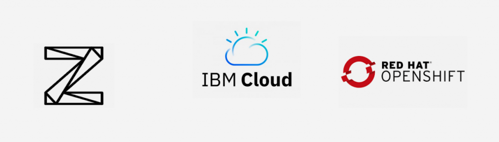

# Dev/Test for mainframe app modernization

**IBM Wazi as a Service (Wazi aaS)** provides developer with a cloud native development and testing environment for z/OS on IBM Cloud.

IBM Wazi delivers a cloud native development experience for z/OS. It enables application developers to develop and test z/OS application components in a virtual z/OS environment on an OpenShift-powered hybrid multicloud platform, and to use an industry standard integrated development environment (IDE) of your choice.

!!! quote 

    Get on-demand access to z/OS dev and test in minutes

With IBM Wazi as a Service, you can spin up a new, on-demand virtual server instance (VSI) on IBM Cloud that runs z/OS on actual IBM Z (s390x) hardware in just minutes. This is perfect for your z/OS application development and testing workflows or for ramping up skills in your z/OS practice.

!!! tip

    IBM Wazi as a Service enables you to have self-serve access to z/OS systems and shorten your development and testing cycles. You can further integrate a secure toolchain for continuous delivery to enhance your developer productivity. With increased efficiency in code development and testing, you can reduce time to market.
    
    Use a combination of your desktop with your favorite IDE, containers and dev/test on desktops, performance testing on mainframe in the IBM Cloud, and deploy to production mainframe.

You can now spin up a built-for-a-purpose z/OS dev and test virtual server in six minutes or less. 

You can either use a pre-installed stock image or extract components from an on-prem system and deploy a custom image onto the virtual server using **IBM Wazi Image Builder** in IBM Cloud’s Virtual Private Cloud environment. This environment is a logically isolated, highly secured private space running in IBM Cloud, thereby eliminating the wait times involved in getting access to resources.

!!! key "Benefits"

    - Bridges the gap between the developer experience on distributed and mainframe platform during development of hybrid applications that contain z/OS application components.
    - Delivers cloud native development experience for z/OS that is portable across any cloud or platform and optimized to run on OpenShift.
    - Allows developers to develop and test z/OS applications by using a personal sandbox environment on OpenShift.
    - Helps developers unfamiliar with z/OS and IBM Z® get up to speed quickly and become productive in developing and delivering applications.
    - Supports edit, build, and debug via an industry standard IDE such as VS Code or Eclipse that integrates with a standard, open tool chain via a modern SCM, for example, Git.
    - Helps developers rapidly assess the impact of the changes they make as often as needed.
    - Rebalances entitlement over time flexibly based on your business needs.
    - Addresses the lack of deployment options for mainframe environments by automating the deployment to z/OS environments through open source standard technologies.
    - Automates pipeline delivery with modern tools and standard processes across platforms.
    - Streamlines the building and deployment of z/OS applications through a CI/CD pipeline.

The following shows how the components of Wazi as a Service integrates into a hybrid cloud world.

In this article, learn the key components to Wazi and how to get started.

## IBM Cloud

IBM Cloud is expanding z/OS dev/test capabilities with IBM Wazi-as-a-Service is designed to provide z/OS developers with on-demand access to z/OS resources and enable you to do the following:

- Do dev/test, including quality testing, on demand.
- Leverage the agility of a public cloud development environment.
- Use a variable amount of resource and only pay for what they use.

Tests run in the IBM Cloud Tokyo Multi-Zone Region show about 15x faster compilation for Java applications, about 12x for C applications and about 8x for COBOL/FORTRAN apps through IBM Wazi aaS, as compared to Z Development and Test environment (ZD&T) on x86.[^1]

Consistent with the regulated workloads of many IBM Z clients today, IBM Wazi aaS will allow self-provisioning of a z/OS Virtual Server Instance on [IBM Cloud Virtual Private Cloud (VPC)](https://www.ibm.com/cloud/virtual-servers) — a logically isolated, highly-secured private space running in IBM Cloud.

## Developing z/OS applications with IBM Wazi

IBM Wazi delivers a cloud native development experience for z/OS. It enables application developers to develop and test z/OS application components in a virtual z/OS environment on an OpenShift-powered hybrid cloud platform, and to use an industry-standard integrated development environment (IDE) of their choice.

The following diagram shows how IBM Wazi fits in the **IBM Z and Cloud Modernization Stack**.

IBM Wazi delivers a cloud native development experience for z/OS. It enables application developers to develop and test z/OS application components in a virtual z/OS environment on an OpenShift-powered hybrid cloud platform, and to use an industry-standard integrated development environment (IDE) of their choice.

IBM Wazi provides the following components:

- **Wazi Sandbox** enables self-service provisioning of z/OS runtimes and databases and provides a fully virtual z/OS environment that enables development and testing of z/OS applications on Red Hat® OpenShift® running on x86_64 hardware.
- **Wazi Code** offers essential z/OS development capabilities, with a choice of three IDEs: IBM Wazi for Dev Spaces and IBM Wazi for VS Code.
- **Wazi Analyze** creates rapid, graphical analysis in an installation-free and configuration-free web UI. With the Analyze component, developers can discover the relationships among their z/OS application artifacts and quickly understand the impact of the changes that they want to make.
- **Wazi Deploy** accelerates the customization and automation of z/OS application deployment for test and production environments in a continuous integration/continuous delivery (CI/CD) pipeline.

You can mix and match those components and their subcomponents as you need with multiple use cases. Depending on the use case you select, the installation, configuration, and usage tasks vary.

The following architecture diagram shows the overall architectural view of IBM Wazi.

### Wazi Code

Wazi Code provides the essential developer capabilities that include edit, build, and debug through a [choice in Integrated Development Environment (IDE)](https://www.ibm.com/docs/en/wdfrhcw/1.4.0?topic=developing-applications-your-choice-ide).

Choose between:

- A desktop IDE in VS Code™ extensions
- In-browser OpenShift-native IDE by using OpenShift Dev Spaces

You can also access z/OS resources via Zowe™ and the Remote System Explorer (RSE) API.

Supports COBOL, High-Level Assembler, REXX™ and PL/I; includes modern features like code completion, real-time syntax checking, and copybook navigation helps to improve code quality.

For more information, see [Developing z/OS applications with IBM Wazi](https://www.ibm.com/docs/en/cloud-paks/z-modernization-stack/2023.4?topic=develop-zos-applications-wazi).

### Wazi Analyze

Offers a containerized component that creates rapid, graphical analysis in an installation-free and configuration-free web UI. With the Analyze component, developers can discover the relationships among their z/OS application artifacts and quickly understand the impact of any changes you make. 

Graphical visualization of COBOL application artifact dependencies in a web user interface helps analyze impact of potential changes.

Wazi Analyze runs in a containerized environment to give developers the flexibility to run it in any environment and accelerates application modernization. 

For more information, see [Understanding the impact of changes with IBM Wazi Analyze](https://www.ibm.com/docs/en/cloud-paks/z-modernization-stack/2023.2?topic=wazi-understanding-impact-changes-analyze).

### Wazi Sandbox

Enables you to self provision z/OS runtimes and databases and provides a fully virtual z/OS environment that enables development and testing of z/OS applications on OpenShift running on x86_64 hardware. 

Develop and test z/OS application components without requiring IBM Z hardware, then deploy the code to either the sandbox testing stage or IBM Z for production.

The following diagram shows the components of Sandbox and how they work together. 

For more information, see [Managing development and test environments with Sandbox](https://www.ibm.com/docs/en/cloud-paks/z-modernization-stack/2023.2?topic=host-option-1-managing-development-test-environments-sandbox).

## Wazi Image Builder

Use IBM® Wazi Image Builder to create and manage custom images from an existing Z platform. It includes a web UI with role-based access and REST APIs to streamline the creation process. You can then deploy the custom images to IBM Cloud VPC to create a virtual server instance.

IBM Wazi Image Builder enables enterprises to extract their on-premise IBM Z® platforms and deploy it as a custom image through API or web-based graphical interface for use within the IBM Cloud® Virtual Private Cloud (VPC) infrastructure. Wazi Image Builder can be installed on an x86_64 Linux® system hosted either in a cloud or an on-premise physical or virtual machine.

See [Wazi Image Builder](./imagebuilder.md) in this wiki.

## DevOps

IBM Wazi Developer integrates with standard and open DevOps tooling like Git, GitLab, Jenkins, and UrbanCode Deploy so no direct human involvement is required when building or deploying applications to your application platform. You will be able to deliver software more frequently with higher quality.

Containerized development on x86.

Use use the pipeline capability to define the whole application lifecycle by automating the workflow, from the building stage to the provisioning and deploying stages. For more information about the pipeline capability, see [Creating a CI/CD pipeline for z/OS applications](https://www.ibm.com/docs/en/SSV97FN_2022.1.1/wazidoc/com.ibm.wazi.developer.pipeline/pipeline_intro.html).

## Next steps

See video at [Overview of IBM Wazi as a Service](https://www.ibm.com/docs/en/wazi-aas/1.0.0?topic=overview).

Next, learn how you can get started learning mainframe development:

- [Developer fundamentals](#developer-fundamentals)
- [IBM Redbooks publication](#ibm-redbooks-publication)
- [Set up Wazi as a Service](#setup-wazi-as-a-service)

### Get set up

See the following documentation to get set up with Wazi as a Service:

1. [Prerequisites](https://www.ibm.com/docs/en/wazi-aas/1.0.0?topic=service-prerequisites)
2. [Configuring access to services](https://www.ibm.com/docs/en/wazi-aas/1.0.0?topic=service-configuring-access-services)
3. [Wazi as a Service set up](./wazisetup.md)

### Developer fundamentals

[IBM Wazi Developer Fundamentals](https://yourlearning.ibm.com/credential/CREDLY-bf46e58b-5c2d-4112-8a90-cd6f2924bbee) badge earner has a good understanding of the capabilities, benefits and usage of Wazi Developer. This includes capabilities and benefits for Wazi Developers, how to use Wazi Developer, and how it supports J2C.

Upon completion of this course, you will be familiar with the following topics:

- Module 1 – Why Wazi Developer
- Module 2 – What is Wazi Developer
- Module 3 – How does it work
- Module 4 – Wazi Sandbox: Managing development and test environments
- Module 5 – Wazi Code: Developing applications with your choice of IDE
- Module 6 – Wazi Analyze: Understand the impact of changes with IBM Wazi
- Module 7 – Create a CI/CD pipeline for a z/OS application
- Module 8 – zTrial and Badge Quiz

### IBM Redbooks publication

This IBM Redpaper publication takes a deep dive that demonstrates implementation approaches to modernization when adopting a hybrid cloud with IBM Z. We discuss and demonstrate application centric, data integration/access centric, and event driven modernization patterns.

Additionally, we provide a chapter on modernizing an enterprise's DevOps with patterns and a chapter on managing your applications.

Finally, we conclude with a demonstration of deployments of production applications.

This IBM Redbooks® publication provides information for IT Architects, IT Specialists and system administrators.

See **IBM Redbooks publication** [Mainframe Application Modernization Patterns for Hybrid Cloud](https://www.redbooks.ibm.com/abstracts/sg248532.html).

### Setup Wazi as a Service

See [Setup Wazi as a Service](./wazisetup.md).

## Reference

- Blog post [Introducing IBM Wazi as a Service to Accelerate Innovation with IBM z/OS Dev and Test](https://www.ibm.com/blog/announcement/introducing-ibm-wazi-as-a-service/)
- Blog post [IBM Cloud Delivers a New Era of Modernization with IBM Z](https://www.ibm.com/blog/announcement/ibm-cloud-delivers-a-new-era-of-modernization-with-ibm-z/)
- Product page [IBM Wazi as a Service](https://www.ibm.com/cloud/wazi-as-a-service)
- Course [IBM Wazi Developer Fundamentals](https://learn.ibm.com/course/view.php?id=8999)
- Downloadable white paper: [Improve business agility and provide modern DevOps platform for mainframe applications with IBM Cloud](https://www.ibm.com/downloads/cas/Y3JDDJOD)

[^1]: 
    Performance results based on IBM internal tests running application compiles on an experimental IBM Cloud z/OS V2R4 Virtual Server Instance (VSI) with profile mz2o-2×16 versus on IBM ZD&T EE V13.3 running in an IBM Cloud x86 VSI with profile mx2-2×16. IBM ZD&T was running on Ubuntu 20.4 on a x86 Production VSI with a Cascade Lake Intel Xeon Platinum CPU @ 2.4GHz. Both z/OS VSI and ZD&T were configured with 2 vCPUs, 16GB memory, and 1 TB Block storage with 10 IOPS/GB. The following applications were compiled: a Java application that processes SMF records, a C application that processes IBM Z hardware diagnostic data, a COBOL application that creates and updates records on a file and a FORTRAN statistical application. Results may vary. 