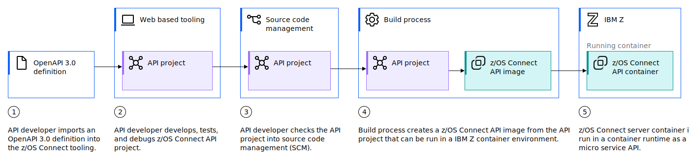

# z/OS Connect for OpenAPI 3 interfaces

Use **IBM z/OS Connect** to create [OpenAPI 3 (Swagger) interfaces](https://swagger.io/specification/).

Use the rich mapping capabilities of z/OS Connect to integrate to and from z/OS applications and data via RESTful OpenAPI 3 APIs. Create contract-first APIs, then deploy API integrations as isolated and secure microservices across the enterprise.

!!! key "Business value"

    - Unlock data in your mainframe for use by new applications, data science, automation processes
    - Incorporate cloud native hybrid cloud applications to use your mainframe data
    - Keep data secure 

## Expose data and processing through API

New initiatives often impose significant demands on applications and data because timely access to data drives new business processes and better customer experiences. 

!!! tip

    Many organizations continue to rely on core applications and data on IBM Z. To accelerate digital transformation, organizations must embark on a strategy to modernize core applications and build new ones. 

However, challenges often arise when it comes to updating mainframe-based monolithic applications to support new business initiatives. Risks are involved, and the effort that is required to develop the new features and test the application is often significant. Alternatively, 
a full rebuild also faces multiple challenges, such as high development costs; lack of documentation and understanding of the business logic; exposure risks to business-critical data; and poor performance and availability.

A good starting point for modernization is to leverage core business-critical applications on IBM Z by using APIs that are consumed by new cloud-native application logic, such as mobile or cognitive applications. You must develop APIs to expose your applications on IBM Z. You 
also need a robust and comprehensive runtime environment for APIs that is scalable, highly available, secure, and that covers all subsystems.

## z/OS Connect capabilities

Simplify working with APIs by using IBM z/OS Connect and benefit from the following capabilities:

- Interact with z/OS applications and data by using APIs that conform to the OpenAPI 3.0 specification.
- Develop a IBM z/OS Connect API starting from an existing OpenAPI 3.0 specification definition.
- Transform z/OS data with functional mapping capabilities and feature-rich tools.
- Deploy IBM z/OS Connect APIs as isolated secure microservices, driving agility across the enterprise.
- Take advantage of the improved security schemes provided by the OpenAPI 3.0 specification to deliver more granular control of user authorization at the API operation level.
- Use Red Hat® OpenShift® Dev Space, Red Hat OpenShift Wazi Dev Space or make the z/OS Connect Designer image available on your image registries for self-service use with an OCI compliant container run time. For example, Podman, or Docker Desktop V19.0.3 or higher.
- Develop APIs in your own IBM z/OS Connect development environment containing an isolated IBM z/OS Connect development server.
- Use JSONata, a powerful data transformation language to enhance your API mapping.
- Manage API projects across your teams by using your choice of Source Control Management (SCM) systems.
- Your CICS® COBOL applications can call APIs that conform to the OpenAPI 3.0 specification through IBM z/OS Connect.

## Create REST API to access existing applications and data

IBM z/OS Connect includes cloud native development support and API first mapping for creating OpenAPI 3 interfaces to z/OS applications and data. To achieve this, we have added two new components; a new container-based deployment model that is known as the IBM z/OS Connect server and a powerful new browser-based tooling that is known as the z/OS Connect Designer.

The following diagram shows z/OS Connect OpenAPI3 provider experience.

For a deep dive in the scenarios used to expose APIs, see [Overview of IBM z/OS Connect (OpenAPI 3)](https://www.ibm.com/docs/en/cloud-paks/z-modernization-stack/2023.4?topic=introduction-overview-zos-connect#overview__title__3).

## Architecture patterns

The section introduces you to how you can accelerate application modernization by using the following application-centric architectural patterns that are designed and published by IBM. You can use them to learn how to implement and deploy them in an IBM Z environment, whether z/OS or Linux, and determine which circumstances are best for your application modernization initiatives. 

For a deep dive, see [Application modernization for IBM Z architecture](https://www.ibm.com/cloud/architecture/architectures/application-modernization-mainframe/).

### Components to invoking APIs on mainframe

The following diagram shows the components that are involved in invoking a mainframe application that is exposed as APIs. 

In the simplified flow example, a cloud-native application invokes an API that is managed, secured, and exposed by an enterprise API management system that uses an API gateway. When the API gateway receives a request, it checks to see whether it is an authorized request. If the request is authorized, the gateway routes the request to a corresponding API that is deployed on z/OS Connect EE that runs on IBM Z. The z/OS 
Connect EE server transforms a REST- or JSON-based API request into a payload according to the specified copybook format. The server also invokes a z/OS application that runs on a subsystem such as CICS, IMS, or IBM Db2®. Similarly, the z/OS Connect EE server transforms the response from the application into the results format that the API definition specifies.

### Security flow

Security information is exchanged and extra operations are performed by the runtime components as part of the API runtime invocation flow. Security cannot be achieved in isolation by a single component, but rather with an end-to-end view across middleware components to enable the overall runtime flow. Disparate technologies are used for authentication, authorization, user registries, identity mapping/propagation, maintaining audit trail, and security token formats that are exchanged across components. The flow illustrates a high-level view of how various components participate in the security flow, rather than a detailed or concrete example.

In the flow shown in the following diagram, a Cloud native application invokes an API to access _Systems of Record (SOR)_ data (such as customer info). This in turn, invokes an existing mainframe application (such as a CICS application) that has been exposed as an API. 

The flow here highlights only the key security aspects:

1. **Authentication**: Identifying the invoking component at each step of the flow or the identity of the client on whose behalf the flow is initiated. Authentication can be based on userid/password, certificate, or token based on third-party authentication, such as OpenId.
2. **Encryption**: Protects communication between the client and server at each stage of the flow with transport level security (SSL or TLS).
3. **Authorization**: Policy enforcement that is based on identity, ensuring that the client is permitted to invoke the component.
4. **Audit**: A record is maintained on the identity of the invoker and on which API is invoked.
5. **User registry**: Maintains the profiles of the clients for each stage.

For more information, see [IBM Z application and data access through APIs](https://www.ibm.com/cloud/architecture/architectures/zapi-access-mainframe-applications/reference-architecture).

### Extend with Cloud Native applications

The _Extend with cloud-native_ pattern shown in the following figure shows the process and components that are involved to extend a core application on z/OS, whether CICS, IMS, or batch, by writing new functions as cloud-native applications. 

Communication between the core application on z/OS and the cloud-native application occurs by using well-defined APIs.

A key business benefit of using this pattern is that enterprises do not need to abandon their investment in core applications on IBM Z. Instead, they can extend the capabilities of their applications with cloud-native applications. The usage of cloud-native technologies can 
enable organizations to build highly scalable applications in a modern environment with private, public, and hybrid clouds

For more information and deep dive into the considerations and code samples for deployment, see [Mainframe Application Modernization Patterns for Hybrid Cloud](https://www.redbooks.ibm.com/redbooks/pdfs/sg248532.pdf).

## Next steps

Study [Mainframe Application Modernization Patterns for Hybrid Cloud](https://www.redbooks.ibm.com/redbooks/pdfs/sg248532.pdf).

Learn about how to use z/OS Connect Images in production. See [z/OS Connect Images](https://www.ibm.com/docs/en/cloud-paks/z-modernization-stack/2023.4?topic=introduction-overview-zos-connect#overview__title__8).

See [Getting started checklist](https://www.ibm.com/docs/en/cloud-paks/z-modernization-stack/2023.4?topic=introduction-getting-started-checklist).

Learn about and join [z/OS Connect Design Partnership Program](https://www.ibm.com/docs/en/cloud-paks/z-modernization-stack/2023.4?topic=introduction-zos-connect-design-partnership-program).

## Reference

- [Accessing Z assets (z/OS Connect)](https://www.ibm.com/docs/en/cloud-paks/z-modernization-stack/2023.4?topic=access-z-assets-zos-connect)
- Redbook: [Mainframe Application Modernization Patterns for Hybrid Cloud](https://www.redbooks.ibm.com/redbooks/pdfs/sg248532.pdf)
- [Application modernization for IBM Z architecture](https://www.ibm.com/cloud/architecture/architectures/application-modernization-mainframe/)