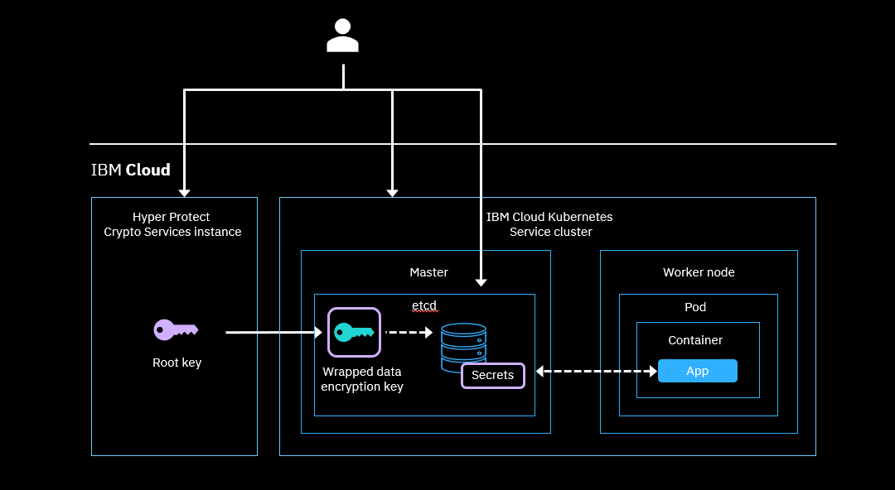
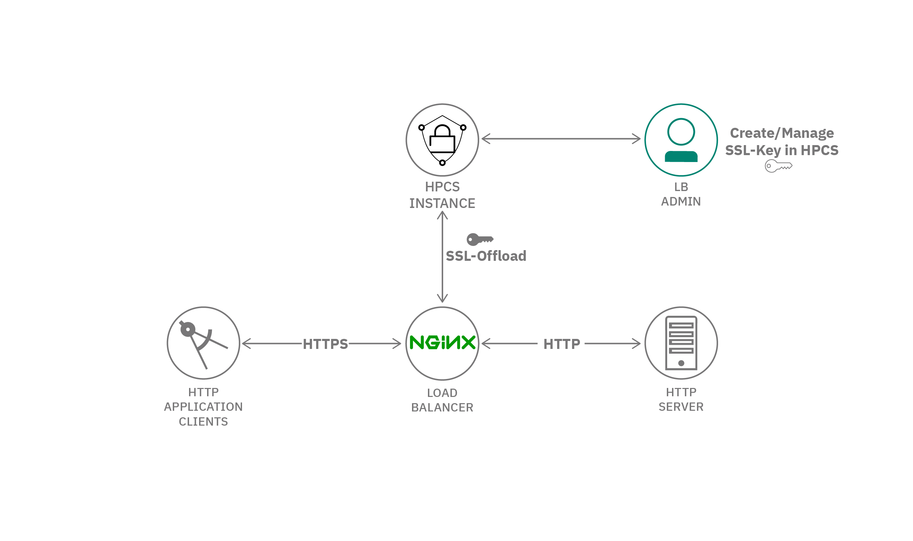

# Hyper Protect Crypto Services Tutorials

This article directs you to some tutorials to use **Hyper Protect Crypto Services**.

## Provisioning an instance of Hyper Protect Crypto Services Standard Plan

You can create an instance of IBM Cloud Hyper Protect Crypto Services by using the IBM Cloud console or the IBM Cloud CLI.

See [Provisioning an instance of Hyper Protect Crypto Services Standard Plan](https://cloud.ibm.com/docs/hs-crypto?topic=hs-crypto-provision&interface=ui.)

## Deploy Hyper Protect Services using Terraform

Step by step instruction on how to [Use Terraform to automate deployment of IBM Cloud Hyper Protect Services](https://developer.ibm.com/tutorials/use-terraform-to-automate-deployment-of-ibm-cloud-hyper-protect-services/). This tutorial shows you how to provision each of these resources on IBM Cloud using Terraform:

- IBM Cloud console UI
- REST APIs
- IBM Cloud CLI
- Terraform

## Encrypt Kubernetes secrets 

Users who are looking to safeguard highly sensitive data want to use their own keys for encryption and also require complete control of their encryption keys. For these users, Hyper Protect Crypto Services provides exclusive control over the entire key hierarchy, including the master key of the HSM that protects the secrets. The Level-4 certification assures that the HSM is tamper-proof—it can sense any attempt to compromise the HSM via physical, chemical, or environmental changes and immediately responds by auto-erasing the keys stored, which then invalidates the data that the keys protect.

This tutorial shows you how to encrypt your Kubernetes secrets using IBM Cloud Hyper Protect Crypto Services as the KMS provider. You'll learn how to create a secret in IBM Cloud Kubernetes, create a root key in Hyper Protect Crypto Services, and encrypt the secrets and etcd component of your Kubernetes master with the root key in your Hyper Protect Crypto Services instance.

See [Encrypt Kubernetes secrets with IBM Cloud Hyper Protect Crypto Services](https://developer.ibm.com/tutorials/encrypt-kubernetes-secrets-with-hyper-protect-crypto-services/)

The following diagram illustrates the architecture of this integration.

## Protect LUKS encryption keys

This tutorial provides step-by-step instructions on how to protect [Linux Unified Key Setup (LUKS)](https://en.wikipedia.org/wiki/Linux_Unified_Key_Setup) encryption keys from being compromised by using either IBM Cloud [Hyper Protect Crypto Services (HPCS)](https://www.ibm.com/cloud/hyper-protect-crypto?_gl=1*3kgdei*_ga*MzIxMDU5Njc3LjE2OTIxOTgwODI.*_ga_FYECCCS21D*MTY5MjM4NTg5NC4xMC4xLjE2OTIzOTY0NTEuMC4wLjA.) or IBM [Key Protect](https://www.ibm.com/cloud/key-protect?_gl=1*3kgdei*_ga*MzIxMDU5Njc3LjE2OTIxOTgwODI.*_ga_FYECCCS21D*MTY5MjM4NTg5NC4xMC4xLjE2OTIzOTY0NTEuMC4wLjA.) as the single point of control to enable or disable access to data across the enterprise. It does this by successively wrapping encryption keys, with the ultimate control being a master key that resides in a hardware security module (HSM).

See [Protect LUKS encryption keys with IBM Cloud Hyper Protect Crypto Services and IBM Key Protect](https://developer.ibm.com/tutorials/protect-luks-encryption-keys-with-ibm-cloud-hyper-protect-crypto-services/)

The following diagram illustrates a scenario where Linux servers using LUKS encryption keys in diverse environments, such as on-premises, IBM Cloud, or competitor cloud. These Linux servers can reach out to Hyper Protect Crypto Services using an API call / PKCS#11 to wrap the LUKS keys with a root key from Hyper Protect Crypto Services. (Note: All keys generated by Hyper Protect Crypto Services are wrapped by the master key.)

## Offload NGINX TLS tutorial

Offloading TLS to a load balancer like NGINX allows for a single, centralized point of control and management.

This tutorial explains how to use a container `nginx-tls-offload` to perform TLS offloading on an NGINX web server using private keys protected by IBM Cloud Hyper Protect Crypto Service.

See [Use IBM Cloud Hyper Protect Crypto Services to offload NGINX TLS](https://developer.ibm.com/tutorials/use-hyper-protect-crypto-services-to-offload-nginx-tls/).

## Encrypt VMware disks tutorial

Encrypt disks in an existing IBM Cloud VMware estate using secure key storage and a KMIP instance.

See [Use IBM Cloud Hyper Protect Crypto Services to encrypt VMware disks](https://developer.ibm.com/tutorials/use-hyper-protect-crypto-services-to-encrypt-vmware-disks/).

## How to use Hyper Protect Crypto Services

See the documentation [Hyper Protect Crypto Services - How to](https://cloud.ibm.com/docs/hs-crypto?topic=hs-crypto-envelope-encryption). 