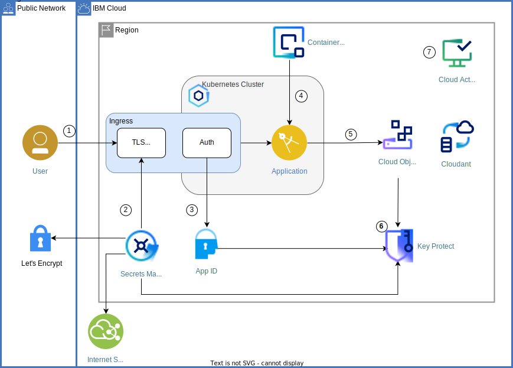
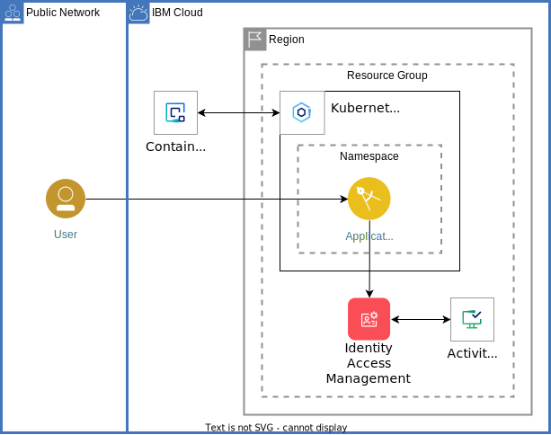

# Key Protect Tutorials

**IBM Key Protect** helps you secure sensitive data from unauthorized access or inadvertent employee release while meeting compliance auditing standards. 

IBM® Key Protect is a full-service encryption solution that allows data to be secured and stored in IBM Cloud™ using the latest envelope encryption techniques. Encryption keys can be provisioned or imported for use with applications for many IBM Cloud™ services and then managed from a central location.

## Getting started tutorial

[Getting started tutorial](https://cloud.ibm.com/docs/key-protect?topic=key-protect-getting-started-tutorial) shows you how to create and import existing cryptographic keys by using the **Key Protect dashboard**.

To learn about the process of creating or importing keys into Key Protect, see [Creating and importing encryption keys](https://cloud.ibm.com/docs/key-protect?topic=key-protect-tutorial-import-keys).

## Secure cloud application

This tutorial walks you through key security services available in the IBM Cloud® catalog and how to use them together. An application that provides file sharing will put security concepts into practice.

No application architecture is complete without a clear understanding of potential security risks and how to protect against such threats. Application data is a critical resource which can not be lost, compromised or stolen. Additionally, data should be protected at rest and in transit through encryption techniques. Encrypting data at rest protects information from disclosure even when it is lost or stolen. Encrypting data in transit (e.g. over the Internet) through methods such as HTTPS, SSL, and TLS prevents eavesdropping and so called man-in-the-middle attacks.

Authenticating and authorizing users' access to specific resources is another common requirement for many applications. Different authentication schemes may need to be supported: customers and suppliers using social identities, partners from cloud-hosted directories, and employees from an organization’s identity provider.

See [Apply end to end security to a cloud application](https://cloud.ibm.com/docs/solution-tutorials?topic=solution-tutorials-cloud-e2e-security) that shows how to:

- Encrypt content in storage buckets with your own encryption keys
- Require users to authenticate before accessing an application
- Monitor and audit security-related API calls and other actions across cloud services

The following diagram shows how the tutorial secures application in a Classic Infrastructure or VPC Infrastructure where groups of users upload files to a common storage pool and to provides access to those files via shareable links.

### Next steps in security

- See [Enhance security of your deployed application](https://cloud.ibm.com/docs/solution-tutorials?topic=solution-tutorials-extended-app-security) to assess and harden an application with the following architecture:

## Use trusted profiles for secure cloud environments

With IBM Cloud [Identity and Access Management (IAM)](https://cloud.ibm.com/docs/account?topic=account-cloudaccess) you control which users see, create, use, and manage resources in your cloud environment.

In this tutorial, you learn about [trusted profiles](https://cloud.ibm.com/docs/account?topic=account-identity-overview#trustedprofiles-bestpract), their use cases, and how to utilize them for enhanced security. Trusted profiles can serve as foundation for secure cloud environments, as building block for secure cloud solutions. As part of this tutorial, you will create a trusted profile which is utilized by an app to perform administrative tasks.

See [Use trusted profiles as foundation for secure cloud environments](https://cloud.ibm.com/docs/solution-tutorials?topic=solution-tutorials-trusted-profile-for-enterprise-security).

The following diagram shows the solution architecture used in this tutorial.

## Microservices writing to a consolidated database

Kn this tutorial you will build and deploy an application that shows how to interface a key management solution like IBM Cloud™ Hyper Protect Crypto Services with a database back end, such as IBM Cloud Hyper Protect DBaaS for MongoDB. In doing so, you can see how to use an IBM Cloud identity and access management (IAM) API key to authenticate and drive a Key Protect REST API to generate keys used to encrypt information before storing in a database.

See [Create secure microservices writing to a consolidated database](https://developer.ibm.com/patterns/create-a-secured-microservices-and-deploy-it-to-a-consolidated-database/?_gl=1*11in9e1*_ga*MzIxMDU5Njc3LjE2OTIxOTgwODI.*_ga_FYECCCS21D*MTY5MjM4NTg5NC4xMC4xLjE2OTI0MDExMDIuMC4wLjA.)

The following diagram shows the flow.

## Encrypt a bucket with Key Protect

While all data stored in Cloud Object Storage is automatically encrypted using randomly generated keys, some workloads require that the keys can be rotated, deleted, or otherwise controlled by a key management system (KMS) like Key Protect.

See [Encrypting a bucket with Key Protect](https://cloud.ibm.com/docs/cloud-object-storage?topic=cloud-object-storage-tutorial-kp-encrypt-bucket).

## Reference

- [IBM Key Protect docs](https://cloud.ibm.com/docs/key-protect/index.html)
