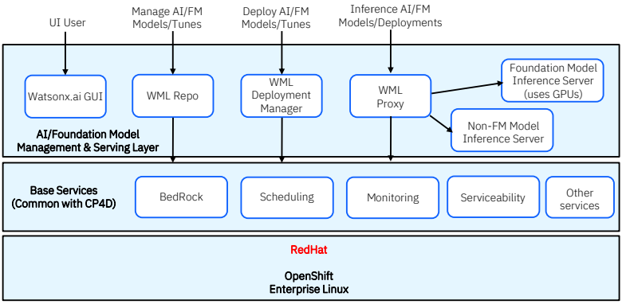

# About watson.ai

**watsonx.ai** is the next-generation enterprise studio for AI builders. It combines traditional machine learning and new generative AI capabilities powered by foundation models into a powerful platform that enables you to build AI applications in a fraction of the time with a fraction of the data. Traditional AI tools, while powerful, can be expensive, time-consuming, and challenging to use. 

Data must be laboriously collected, curated, and labeled with task-specific annotations to train AI models. Up until now, building a model required specialized, hard-to-find skills — and each new task required repeating this process.

watsonx facilitates the entire data and AI lifecycle from data preparation to model development, deployment, and monitoring.

## Product offering

You can accomplish the following goals with watsonx:

- **Build machine learning models**. Build models by using open source frameworks and code-based, automated, or visual data science tools.
- **Experiment with foundation models**. Test prompts to generate, classify, summarize, or extract content from your input text. Choose from IBM models or open source models from Hugging Face.
- **Manage the AI lifecycle**. Manage and automate the full AI model lifecycle with all the integrated tools and runtimes to train, validate, and deploy AI models.
- **Govern AI**. Track and document the detailed history of AI models to help ensure compliance.

### Generative AI 

– Manage tasks such as content generation and extraction with foundation model libraries and use IBM-selected open-source models from Hugging Face. 
– Use prompts to summarize documents, create content for marketing campaigns, extract information from unstructured text, and more. 
– Use APIs and SDKs to integrate generative AI with applications

### Machine learning 

– Build, train and deploy machine learning models with an MLOps collaborative studio. 
– Construct solution engines for mathematical and constraint programming to address decision-optimization use cases. 
– Automate data preparation, model development, feature engineering and hyper-parameter optimization. 
– Create data preparation and predictive machine learning pipelines with visual modeling. 
– Get complete API and SDK for application integration

Reference: [Train, validate, tune and deploy AI models](https://www.ibm.com/downloads/cas/VBAMQA3R)

### Foundation models

The introduction of foundation models provides a powerful and versatile foundation for a variety of AI applications. Clients can use foundation models to quickly perform tasks with limited annotated data and minimal effort; in some cases, users need only describe the task to coax the model into solving it. IBM’s new watsonx.ai studio offers a suite of foundation models aimed at delivering enterprise value. They’ve been incorporated into a range of IBM products that will be made available to IBM clients in the coming months.

IBM’s foundation models are developed, deployed, and validated using IBM’s industry-leading best practices in AI Governance. The data used to train IBM models was vetted for legal and safety concerns, and carefully curated by filtering out language reflecting hate/abuse/profanity, as well as removing duplicate data (note: duplicate data in the training set increases the risk of bias).

For more details, see the PowerPoint deck [Introduction to Generative AI for Enterprise Business](https://ibm.box.com/shared/static/4pvf6iuhkgf6xwxg4cg2cwkirzi8xu64.pptx).

Start with foundation models From IBM, [Hugging Face](https://huggingface.co/blog/huggingface-and-ibm), or your own.

The foundation model capabilities within watsonx.ai fit into a greater data and AI platform, watsonx, alongside two other key pillars watsonx.data and watsonx.governance. Together, watsonx offers organizations the ability to:

- Train, tune and deploy AI across your business with watsonx.ai
- Scale AI workloads, for all your data, anywhere with watsonx.data
- Enable responsible, transparent and explainable data and AI workflow with watsonx.governance

## Studio

At its core, watsonx.ai is a next generation enterprise studio for AI builders to train, test, tune, and deploy both traditional machine learning and new generative AI capabilities powered by foundation models through an open and intuitive user interface. 

The [studio](https://www.ibm.com/blog/introducing-the-technology-behind-watsonx-ai) includes a foundation model library that gives users easy access to IBM curated and trained foundation models. The IBM foundation models use a large, curated set of enterprise data backed by a robust filtering and cleansing process and auditable data lineage. These models are being trained not just on language, but on a variety of modalities, including code, time-series data, tabular data, geospatial data, and IT events data. 

Examples of model categories include:

- **fm.code**: Models built to automatically generate code for developers through a natural-language interface to boost developer productivity and enable the automation of many IT tasks.
- **fm.NLP**: A collection of large language models (LLMs) for specific or industry-specific domains that utilize curated data where bias can be mitigated more easily and can be quickly customized using client data.
- **fm.geospatial**: Model built on climate and remote sensing data to help organizations understand and plan for changes in natural disaster patterns, biodiversity, land use, and other geophysical processes that could impact their businesses.

## watson.ai internal architecture

Reference: https://ibm.seismic.com/Link/Content/DCf2fm239G3dBGHRcf9BWXCh7PWG

## Traditional AI

The traditional, non-foundational ML models supported in Watson Studio today will also be supported in watsonx. These include:

- AutoAI and its many regression, classification, and forecasting models
- The hundreds of diverse open-source ML models in the scikit-learn library, along with the deep learning libraries of TensorFlow and PyTorch
- Decision Optimization's CPLEX solver
- SPSS Modeler's catalog of 50+ ML algorithms
- Watson NLP's suite of models
- and many more...

A list of the supported ML frameworks for deployment can be found at   [Supported machine learning tools, libraries, frameworks, and software specifications - Docs | IBM Cloud Pak for Data as a Service](https://dataplatform.cloud.ibm.com/docs/content/wsj/analyze-data/pm_service_supported_frameworks.html?context=wdp&audience=wdp)

However, classic machine learning lent itself well to “exploration-style” approaches to find optimal or near-optimal model architectures. Foundation models are different. While there is an opportunity to use tools, guides, and automation while building FMs, it will look different than the “exploration style” using Auto AI. For example, while building FMs, data cleaning and filtering are essential. The tools that automate and optimize this at scale are major accelerators. 

We’re in the early days of understanding which model architectures best fit different problems. There may be an opportunity for automation and model customization i.e. how we customize a base model for the task(s) needed. Right now, it depends on the user knowing what data to provide, how to configure the tuning, and which base model to select. The steps in the process could lend itself well to automated tuning.

## Getting started

You can provision **IBM® Cloud service instances** for the watsonx platform.

The IBM watsonx.ai component provides the following services that provide key functionality, including tools and compute resources:

- [Watson™ Studio](https://www.ibm.com/docs/en/SSYOK8/svc-welcome/wsl.html)
- [Watson Machine Learning](https://www.ibm.com/docs/en/SSYOK8/svc-welcome/wml.html)

See [IBM Cloud services in the IBM watsonx services catalog](https://www.ibm.com/docs/en/watsonx-as-a-service?topic=integrations-cloud-services)

### Set up your service

See:

- [Getting started with IBM watsonx as a Service](https://www.ibm.com/docs/en/watsonx-as-a-service?topic=getting-started)
- [Quick start](https://www.ibm.com/docs/en/watsonx-as-a-service?topic=started-quick-start-tutorials) tutorials.

### Preparing data

- [Refine data](https://www.ibm.com/docs/en/watsonx-as-a-service?topic=tutorials-refine-data)
- [Generate synthetic tabular data](https://www.ibm.com/docs/en/watsonx-as-a-service?topic=tutorials-generate-synthetic-tabular-data)

### Analyzing and visualizing data

- [Notebooks](https://www.ibm.com/docs/en/SSYOK8/wsj/analyze-data/notebooks-and-scripts.html)
- [Analyze data in a Jupyter notebook](https://www.ibm.com/docs/en/watsonx-as-a-service?topic=tutorials-analyze-data-in-jupyter-notebook)

### Building, deploying and trusting models

- [Analyzing data and building models](https://www.ibm.com/docs/en/SSYOK8/wsj/analyze-data/data-science.html)
- [Deploying and managing models](https://www.ibm.com/docs/en/SSYOK8/wsj/wmls/wmls-deploy-overview.html)

Tutorials:

- [Buid a model with AutoAI](https://www.ibm.com/docs/en/watsonx-as-a-service?topic=tutorials-build-model-autoai)
- [Build a model with Jupyter notebook](https://www.ibm.com/docs/en/watsonx-as-a-service?topic=tutorials-build-model-in-jupyter-notebook)
- [Build a model with SPSS Modeler](https://www.ibm.com/docs/en/watsonx-as-a-service?topic=tutorials-build-model-spss-modeler)
- [Build a decision optimization model](https://www.ibm.com/docs/en/watsonx-as-a-service?topic=tutorials-build-decision-optimization-model)
- [Automate the lifecycle of a model with pipelines](https://www.ibm.com/docs/en/watsonx-as-a-service?topic=tutorials-automate-lifecycle-model-pipelines)

### Prompting a foundation model

- [Retrieval-augmented generation pattern](https://www.ibm.com/docs/en/SSYOK8/wsj/analyze-data/fm-rag.html)
- [Prompt Lab](https://www.ibm.com/docs/en/SSYOK8/wsj/analyze-data/fm-prompt-lab.html)
- [Foundation models](https://www.ibm.com/docs/en/SSYOK8/wsj/analyze-data/fm-models.html)

Tutorials:

- [Prompt a foundation model](https://www.ibm.com/docs/en/watsonx-as-a-service?topic=tutorials-prompt-foundation-model)
- [Prompt a foundation model with the retrieval-argumented generation pattern](https://www.ibm.com/docs/en/watsonx-as-a-service?topic=tutorials-prompt-foundation-model-retrieval-augmented-generation-pattern)
- [Tune a foundation model](https://www.ibm.com/docs/en/watsonx-as-a-service?topic=tutorials-tune-foundation-model)

- [Evaluate and trace a prompt template](https://www.ibm.com/docs/en/watsonx-as-a-service?topic=tutorials-evaluate-track-prompt-template)

## References

- [watsonx.ai](https://www.ibm.com/docs/en/watsonx-as-a-service?topic=overview-watsonx)
- [Getting started code](https://github.com/watson-developer-cloud/assistant-toolkit/tree/master/integrations/extensions/starter-kits/language-model-conversational-search)
- White paper [Train, validate, tune and deploy AI models](https://www.ibm.com/downloads/cas/VBAMQA3R)
- [IBM watsonx.ai: Open source, pre-trained foundation models make AI and automation easier than ever before](https://www.ibm.com/blog/ibm-watsonx-ai-open-source-pre-trained-foundation-models-make-ai-and-automation-easier-than-ever-before/)

### IBM Partners

- See [watsonx.ai Sales Kit](https://ibm.seismic.com/Link/Content/DCJH7MbqmMBmG8MPFjm2jWWfjgbP)
- Set up demo with customer. [TechZone now supports watsonx.ai requests](https://techzone.ibm.com/collection/tech-zone-certified-base-images/journey-watsonx) for client demos and POC accounts. An IBM Sales Cloud opportunity number or a Gain-sight Relationship ID is required to reserve an account.
- See [How to Fine-Tune and Use IBM Slate Foundation Models in watsonx.ai](https://ec.yourlearning.ibm.com/w3/playback/10372240)
- See [Foundation Model & Generative AI FAQs](https://w3.ibm.com/w3publisher/ibmsaleszone/expertise/ai-for-business/generative-ai-faqs)
- [TechZone docs](https://foundation-models.tech-patterns.techzone.ibm.com/)
- [IBM Generative AI Architecture](https://pages.github.ibm.com/technical-sales/generative-ai-ref-arch/)